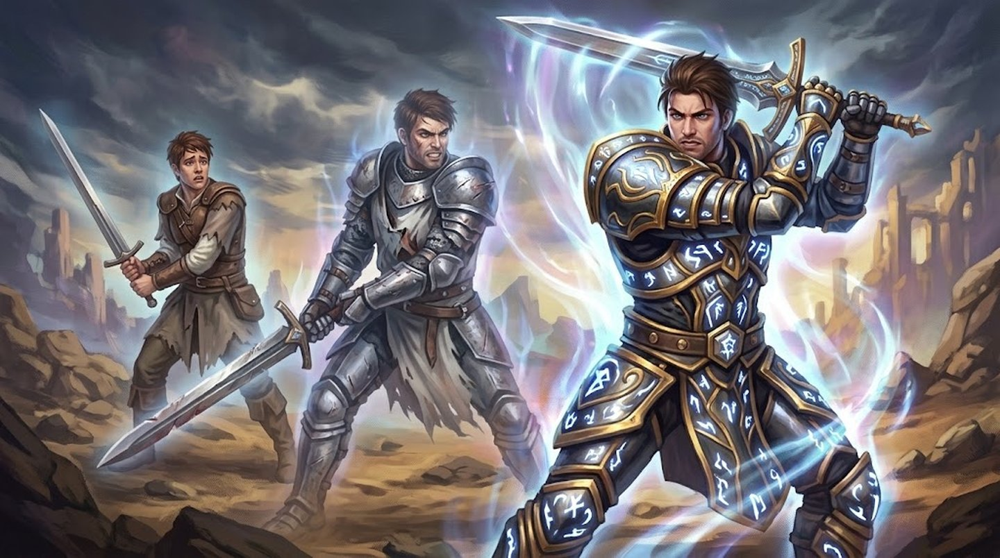

# Progressão de Nível

**Você sobe de nível a cada sessão jogada.** Não há experiência pra somar: jogou, subiu — ver [Progressão: um nível por sessão](../mestre/recompensas.md#progressao-um-nivel-por-sessao) pro lado do Mestre.

O jogo tem **100 níveis**. Dois ganhos correm em paralelo, em ritmos diferentes de propósito:

- **Atributo** — a cada **nível par**, +5 pontos pra distribuir entre os 8 atributos. Constante do nível 2 ao 100 (ver [Atributos](../jogar/atributos.md#a-faixa-de-valores)).
- **Habilidade** — rápido no início, raro depois. A criação já concede a 1ª (ver [Passo 4](index.md#4-primeira-habilidade)); a partir do nível 1, **mais uma a cada nível ímpar até o 39** (20 delas — fecha 21 no total por volta da metade da carreira); depois, só **a cada 10 níveis** (50, 60, 70, 80, 90, 100 — mais 6). **27 Habilidades ao todo.**

| Fase | Níveis | Habilidade | Atributo |
|---|---|---|---|
| Criação | 0 | 1ª (Passo 4) | base 5 + 15 livres |
| Rápida | 1–39 (ímpares) | +1 a cada nível ímpar (20 no total) | — |
| — | 2–40 (pares) | — | +5 a cada nível par |
| Lenta | 50, 60, 70, 80, 90, 100 | +1 em cada marco (6 no total) | — |
| — | 42–100 (pares) | — | +5 a cada nível par |

**Por que esse ritmo:** a mesma lógica que já vale pros atributos — a maioria das campanhas reais não passa de umas 10 sessões, então a progressão rápida (uma Habilidade quase todo nível, nos primeiros 40) é onde a maior parte das mesas realmente vive. Depois do meio de carreira, o personagem já tem um kit amplo — o que os níveis restantes entregam é principalmente **poder** (Atributo, e por consequência Vida/Mana/Estresse/Evasão), não mais botões novos na ficha. 27 habilidades, não 50: escolha continua pesando, em vez de acumular até virar ruído.

??? info "Tabela completa, nível a nível"
    | Nível | Habilidade | Atributo |
    |---|---|---|
    | **0** | 1ª (criação) | base 5 + 15 livres |
    | **1** | +1 (nº 1) |  |
    | **2** |  | +5 |
    | **3** | +1 (nº 2) |  |
    | **4** |  | +5 |
    | **5** | +1 (nº 3) |  |
    | **6** |  | +5 |
    | **7** | +1 (nº 4) |  |
    | **8** |  | +5 |
    | **9** | +1 (nº 5) |  |
    | **10** |  | +5 |
    | **11** | +1 (nº 6) |  |
    | **12** |  | +5 |
    | **13** | +1 (nº 7) |  |
    | **14** |  | +5 |
    | **15** | +1 (nº 8) |  |
    | **16** |  | +5 |
    | **17** | +1 (nº 9) |  |
    | **18** |  | +5 |
    | **19** | +1 (nº 10) |  |
    | **20** |  | +5 |
    | **21** | +1 (nº 11) |  |
    | **22** |  | +5 |
    | **23** | +1 (nº 12) |  |
    | **24** |  | +5 |
    | **25** | +1 (nº 13) |  |
    | **26** |  | +5 |
    | **27** | +1 (nº 14) |  |
    | **28** |  | +5 |
    | **29** | +1 (nº 15) |  |
    | **30** |  | +5 |
    | **31** | +1 (nº 16) |  |
    | **32** |  | +5 |
    | **33** | +1 (nº 17) |  |
    | **34** |  | +5 |
    | **35** | +1 (nº 18) |  |
    | **36** |  | +5 |
    | **37** | +1 (nº 19) |  |
    | **38** |  | +5 |
    | **39** | +1 (nº 20) |  |
    | **40** |  | +5 |
    | **41** |  |  |
    | **42** |  | +5 |
    | **43** |  |  |
    | **44** |  | +5 |
    | **45** |  |  |
    | **46** |  | +5 |
    | **47** |  |  |
    | **48** |  | +5 |
    | **49** |  |  |
    | **50** | +1 (nº 21) | +5 |
    | **51** |  |  |
    | **52** |  | +5 |
    | **53** |  |  |
    | **54** |  | +5 |
    | **55** |  |  |
    | **56** |  | +5 |
    | **57** |  |  |
    | **58** |  | +5 |
    | **59** |  |  |
    | **60** | +1 (nº 22) | +5 |
    | **61** |  |  |
    | **62** |  | +5 |
    | **63** |  |  |
    | **64** |  | +5 |
    | **65** |  |  |
    | **66** |  | +5 |
    | **67** |  |  |
    | **68** |  | +5 |
    | **69** |  |  |
    | **70** | +1 (nº 23) | +5 |
    | **71** |  |  |
    | **72** |  | +5 |
    | **73** |  |  |
    | **74** |  | +5 |
    | **75** |  |  |
    | **76** |  | +5 |
    | **77** |  |  |
    | **78** |  | +5 |
    | **79** |  |  |
    | **80** | +1 (nº 24) | +5 |
    | **81** |  |  |
    | **82** |  | +5 |
    | **83** |  |  |
    | **84** |  | +5 |
    | **85** |  |  |
    | **86** |  | +5 |
    | **87** |  |  |
    | **88** |  | +5 |
    | **89** |  |  |
    | **90** | +1 (nº 25) | +5 |
    | **91** |  |  |
    | **92** |  | +5 |
    | **93** |  |  |
    | **94** |  | +5 |
    | **95** |  |  |
    | **96** |  | +5 |
    | **97** |  |  |
    | **98** |  | +5 |
    | **99** |  |  |
    | **100** | +1 (nº 26) | +5 |

## Escolhendo a habilidade do nível

Todas as habilidades do jogo estão abertas a qualquer personagem, em qualquer nível — não há pré-requisito de nível, atributo, raça ou classe (ver [Requisito suave de Atributo](../jogar/mana.md#requisito-suave-de-atributo) pra quando vale a pena esperar). As duas únicas travas do sistema:

- **Ordem dentro de uma arma:** Básica → Avançada → Especial, e sempre da **mesma** arma.
- **27 escolhas na carreira inteira.** É essa escassez que faz a build.

Use os filtros da [Listagem de Habilidades](../habilidades/index.md) pra ver só o que faz sentido pro seu personagem — por grupo, elemento, arma, atributo, alvo ou Mana disponível.

!!! exemplo "Especializar ou espalhar"
    Investir três escolhas numa única arma (Básica, Avançada, Especial) fecha o kit dela cedo, com uma Intensidade III que resolve encontros sozinha — e sobra a maior parte das 27 pra reforçar em outra direção. Espalhar as escolhas entre grupos diferentes dá um personagem que tem resposta pra tudo e teto pra nada. Nenhuma das duas é errada; o sistema só cobra que você escolha.

## O que cresce sozinho

Vida, Mana e Estresse crescem automaticamente todo nível, sem gastar nenhuma das escolhas acima — são fórmula, não escolha:

- **[Vida Máxima](../glossario.md#vida)** — 20 + Nível + (Defesa × 2) + Vida de equipamento, recalculado a cada nível.
- **[Mana Máximo](../glossario.md#mana)** — 20 + Nível + (Magia × 2) + Mana de equipamento, recalculado a cada nível.
- **[Estresse Máximo](../glossario.md#estresse)** — 20 + Nível + (Sanidade × 2) + equipamento, recalculado a cada nível.

## Subir de atributo

O ponto de atributo do nível par pode ir pra qualquer um dos oito, sem teto por nível (até o teto geral de 100). Vale lembrar o que muda de imediato:

| Se você subir | Muda na hora |
|---|---|
| Ataque | o dano dos seus ataques físicos |
| Defesa | [Vida Máxima](../glossario.md#vida) e Fortitude Física |
| Magia | [Mana Máximo](../glossario.md#mana), Fortitude Mágica e dano mágico |
| Agilidade | [Evasão](../glossario.md#evasao), [Movimento](../glossario.md#movimento) e [Iniciativa](../glossario.md#iniciativa) |
| Sorte | [Iniciativa](../glossario.md#iniciativa), o limiar de [Crítico](../jogar/testes.md#criticos) e o número de [rerolagens](../jogar/testes.md#rerolagens) por descanso longo |
| Sanidade | [Estresse Máximo](../glossario.md#estresse) |
| Social | testes de persuadir, intimidar, enganar (e resistir a tudo isso) |
| Exploração | testes de perceber, rastrear, se orientar, sobreviver |
