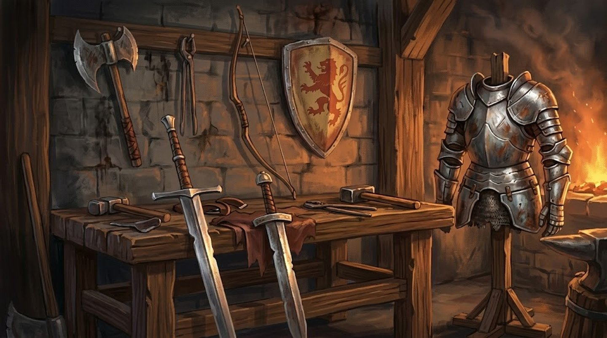

# Regras de Equipamento

O que cada número da ficha de uma arma quer dizer, as propriedades que ela pode
ter, e como o ataque se resolve.

As armas, escudos e armaduras em si estão na listagem de
[Equipamento](index.md) — filtrável por estilo, família, tipo de dano,
propriedade e preço.
