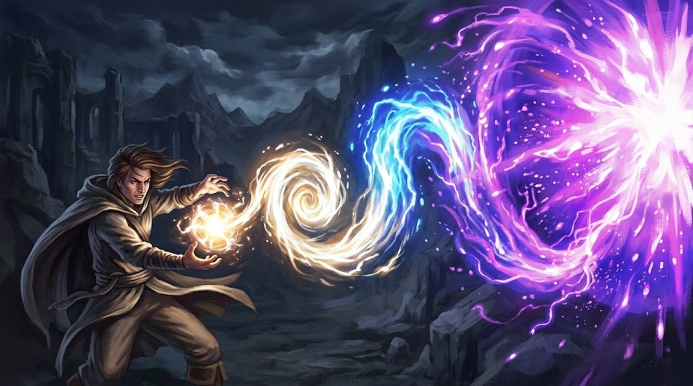

# Regras de Habilidade

Como toda habilidade é escrita e resolvida por baixo do capô — grupos, Intensidade, custo, Dano Desarmado e a assinatura mecânica de cada elemento. Pra navegar e filtrar as habilidades em si, veja a [Listagem de Habilidades](index.md).

## Grupos

| Grupo | Escopo |
|---|---|
| [Marciais](marciais.md) | Armas corpo a corpo / combate a curta distância |
| [Pontaria](pontaria.md) | Armas à distância e precisão (inclui feitiços de precisão) |
| [Mágicas por Elemento](magicas-elementais.md) | Fogo, Gelo, Terra, Sombras, Luz, Arcano, etc. |
| [Sociais](sociais.md) | Persuasão e afins |
| [Infiltração](infiltracao.md) | Furtividade, ladinagem |
| [Mobilidade](mobilidade.md) | Voo, deslocamento |
| [Buff](buff.md) | Incremento de força, imbuir elementos em armas, etc. |
| [Debuff](debuff.md) | Desvantagens para inimigos ou em testes |
| [Suporte](suporte.md) | Cura e apoio a aliados |
| [Necromancia](necromancia.md) | Drenar vigor, amaldiçoar, erguer mortos, gastar a própria vitalidade |
| [Projeção Mental](projecao-mental.md) | Telepatia, ler mentes, ilusão mental, dano psíquico |
| [Alquimia de Mana](alquimia-de-mana.md) | Mana altera a matéria: endurecer o corpo, transmutar, consertar objetos, imbuir armas |
| [Percepção Arcana](percepcao-arcana.md) | Enxergar o invisível, rastrear pelo resíduo de mana, premonição em combate |
| [Conjuração](conjuracao.md) | Trazer aliados de outros lugares/planos pra lutar ao seu lado |
| [Espaço-Tempo](espaco-tempo.md) | Reposicionar à força, distorcer gravidade e manipular o fluxo do tempo |

*(Lista de grupos pode crescer.)*

## Ficha de Habilidade

  

    
      <svg viewBox="0 0 24 24" style="width:11px; height:11px; transform:rotate(-45deg); color:#faf7ef;" fill="none" stroke="currentColor" stroke-width="1.6" stroke-linejoin="round"><path d="M12 2 14 10 22 12 14 14 12 22 10 14 2 12 10 10z"/></svg>
    
    

      
Nome

      
&nbsp;

    

    

      
Chave
&nbsp;

      
Atributo
&nbsp;

      
Tipo de Dano
&nbsp;

      
Vs
&nbsp;

    

    

      
Alvo
&nbsp;

      
Alcance
&nbsp;

      
Área
&nbsp;

      
Duração
&nbsp;

    

    

      Tipo
      <label style="display:flex; align-items:center; gap:2px; font-size:6.8px;">Intensidade</label>
      <label style="display:flex; align-items:center; gap:2px; font-size:6.8px;">Custo Fixo</label>
      <label style="display:flex; align-items:center; gap:2px; font-size:6.8px;">Passiva</label>
    

    

      Ação
      <label style="display:flex; align-items:center; gap:2px; font-size:6.8px;">Ataque</label>
      <label style="display:flex; align-items:center; gap:2px; font-size:6.8px;">Área</label>
      <label style="display:flex; align-items:center; gap:2px; font-size:6.8px;">Efeito</label>
      <label style="display:flex; align-items:center; gap:2px; font-size:6.8px;">
        
        <svg viewBox="0 0 10 10" style="width:7px; height:7px;" aria-hidden="true"><path d="M5 1 L9 9 L1 9 Z" fill="#159c56"/></svg>
        Reação (máx. 1×/rodada)
      </label>
    

    

      Resolução
      <label style="display:flex; align-items:center; gap:2px; font-size:6.8px;">Ataque</label>
      <label style="display:flex; align-items:center; gap:2px; font-size:6.8px;">Teste de Resistência</label>
    

    

      Comp.
      <label style="display:flex; align-items:center; gap:2px; font-size:6.8px;">Verbal</label>
      <label style="display:flex; align-items:center; gap:2px; font-size:6.8px;">Somático</label>
      <label style="display:flex; align-items:center; gap:2px; font-size:6.8px;">Material</label>
    

    

      <label style="display:flex; align-items:center; gap:2px; font-size:6.8px;">Concentração</label>
      <label style="display:flex; align-items:center; gap:2px; font-size:6.8px;">Ritual</label>
      Cooldown&nbsp;
    

    

      

        Intensidade I
        <svg viewBox="0 0 10 10" style="width:6px;height:6px;"><path d="M5 0 L10 5 L5 10 L0 5z" fill="none" stroke="#159c56" stroke-width="1.1"/></svg>
        Mana&nbsp;
        &nbsp;
      

      

        Intensidade II
        <svg viewBox="0 0 10 10" style="width:6px;height:6px;"><path d="M5 0 L10 5 L5 10 L0 5z" fill="none" stroke="#159c56" stroke-width="1.1"/></svg><svg viewBox="0 0 10 10" style="width:6px;height:6px;"><path d="M5 0 L10 5 L5 10 L0 5z" fill="none" stroke="#159c56" stroke-width="1.1"/></svg>
        Mana&nbsp;
        &nbsp;
      

      

        Intensidade III
        <svg viewBox="0 0 10 10" style="width:6px;height:6px;"><path d="M5 0 L10 5 L5 10 L0 5z" fill="none" stroke="#159c56" stroke-width="1.1"/></svg><svg viewBox="0 0 10 10" style="width:6px;height:6px;"><path d="M5 0 L10 5 L5 10 L0 5z" fill="none" stroke="#159c56" stroke-width="1.1"/></svg><svg viewBox="0 0 10 10" style="width:6px;height:6px;"><path d="M5 0 L10 5 L5 10 L0 5z" fill="none" stroke="#159c56" stroke-width="1.1"/></svg>
        Mana&nbsp;
        &nbsp;
      

      

        Crítico
        &nbsp;
      

    

  

Cada habilidade é registrada com:

- **Nome**
- **Descrição breve** — 1 frase evocativa, deixando claro o que a habilidade faz
- **Chave** — para habilidades de arma: "Arma - Grau" (ex: "Espada - Básica"). Para habilidades gerais de grupo: "Grupo - Subtipo" (ex: "Marcial - Especial")
- **Ação** — quando a habilidade entra em jogo: **Ação** (no próprio turno, o caso normal), **Reação** (fora do turno, quando o gatilho acontece — custa 0 PA) ou **Passiva** (nunca é ativada, vale desde que aprendida)
- **Atributo** — atributo usado no teste (ex: ATA)
- **Tipo de Dano / Vs** — o tipo de dano causado (ou **—**, se não causa dano), e contra qual número-alvo a Resolução compara (Evasão por padrão; declarado sempre, mesmo quando é o padrão)
- **Efeitos / Alvos / Alcance / Área / Duração** — Alcance e Área são sempre explícitos, mesmo quando é "corpo a corpo" ou "—"; Duração é **Instantânea** por padrão nas que causam dano direto
- **Resolução** — **Ataque** (o usuário rola), **Teste de Resistência** (o alvo rola) ou **Automática** (ninguém rola: buff, cura, escudo e zona de dano não comparam com número-alvo nenhum, e nesses o campo Vs fica em **—**) — ver [Resolução](#resolucao) e [Teste de Resistência](#teste-de-resistencia)
- **Componentes** — Verbal / Somático / Material, o que a ativação exige fisicamente — ver [Componentes](#componentes)
- **Concentração** — Sim/Não — ver [Concentração](#concentracao)
- **Cooldown** — ver [Cooldown](#cooldown)
- **Ritual** — Sim/Não — ver [Ritual](#ritual)
- **Intensidade I / II / III** — as três versões da habilidade, cada uma com seu custo em Pontos de Ação e Mana
- **Crítico** — dentro do [limiar de Crítico](../jogar/testes.md#criticos) (Sorte ÷ 3)

Todo campo aparece sempre, em toda habilidade — quando não se aplica, o campo permanece com **—** em vez de sumir. O jogo é explícito de propósito: nada fica subentendido pra quem lê a ficha no meio de um turno.

### Intensidade

Toda habilidade de ataque existe em **três Intensidades**. Elas não são compradas com escolhas de nível: estão todas disponíveis desde o momento em que o personagem aprende a habilidade. O que muda é quanto custa usar cada uma — o jogador decide **na hora de ativar**, conforme quanto do turno e do Mana quer investir.

| Intensidade | Pontos de Ação | O que ela entrega |
|---|---|---|
| I | ◈ (1) | O efeito base — normalmente só o dano |
| II | ◈◈ (2) | Acrescenta o efeito secundário (empurrar, Sangrando, Marcado) |
| III | ◈◈◈ (3) | O efeito completo (derrubar, Atordoado) — consome o turno inteiro |

O custo em Mana sobe junto com a Intensidade (ver [Escala de Mana por Intensidade](../jogar/mana.md#escala-de-mana-por-intensidade)).

!!! regra "Alcance e área nunca escalam com Intensidade"
    Uma habilidade que cobre 2 casas de raio cobre 2 casas de raio em qualquer Intensidade — o que a Intensidade compra é o efeito, não o tamanho.

### Habilidades de Custo Fixo

Algumas habilidades não têm Intensidade: trazem **Custo fixo** e um único resultado de **Acerto** na ficha. São os casos em que a força da habilidade já está em outro lugar:

- **Área de 3 casas de raio ou mais** — a área já é o poder; escalar o efeito por cima seria demais
- **Habilidades Supremas** — o custo em Mana (48+) já as coloca fora da escala
- **Efeitos sem nada pra graduar** — quando o efeito é absoluto, não há degrau acima dele. Uma Reação que **anula por completo** um ataque é o caso típico: não existe "anular mais"

O preço de uma habilidade de Custo fixo segue duas regras:

- **Mana:** o valor da Intensidade III da escala em que ela viveria (18-36 pra habilidades comuns; 48+ pra Supremas).
- **PA:** **◈◈◈**, como uma Intensidade III — com duas exceções: **Avançadas de arma** de área cobram **◈◈** (padrão consolidado do Equipamento: ◈◈ + 27 Mana), e **Reações dedicadas** cobram 0. Habilidades utilitárias fora de combate podem declarar PA menor na própria ficha.

!!! regra "Custo fixo não dispensa a rolagem"
    Habilidade de Custo fixo com alvo hostil **rola teste de ataque normalmente** contra o número-alvo do defensor. Só ficam sem rolagem os casos que a [Resolução](#resolucao) isenta: buffs, cura, e Supremas declaradas como inevitáveis.

### Buffs, Suporte e Mobilidade também têm Intensidade

Não ter teste de ataque **não** significa não ter Intensidade. O que escala num buff não é a chance de acertar — é o tamanho do efeito. Cada habilidade escala pelo eixo que faz sentido pra ela:

| Eixo | Quando se aplica | Exemplo |
|---|---|---|
| **Magnitude** | Há um valor que é a identidade do buff | Escudo Mágico: Escudo de 1d8 → 2d8 → 3d8 |
| **Duração** | O efeito é absoluto e não tem número pra crescer | Postura Inabalável: não pode ser derrubado por 2 → 3 → 4 rodadas |
| **Ambos** | Buff de grupo ou transformação, que tem valor *e* prazo | Bênção Divina: +1 → +2 → +3 de bônus, por 3 → 4 → 5 rodadas |

!!! regra "Habilidades dedicadas a Reação são a exceção parcial"
    Continuam custando **0 PA** sempre — essa é a rede de segurança que permite reagir mesmo tendo gastado o turno inteiro. Nelas a Intensidade escolhe apenas **quanto Mana** queimar no momento em que você é atacado.

Como o buff mantém na Intensidade I exatamente o efeito e o custo em Mana que sempre teve, subir de Intensidade é sempre ganho — nunca um pedágio pra ter o de antes.

### Habilidades com Tiers de Resultado

Um punhado de habilidades faz algo que **não deveria ser garantido só por pagar o custo** — trazer um aliado morto de volta é o caso central. Nessas, o d100 volta a graduar o resultado: a rolagem decide entre falha catastrófica, falha recuperável e sucesso.

| Total (d100 + Atributo) | Resultado |
|---|---|
| ≤ 50 | Falha total — a pior consequência possível |
| 51–80 | Falha, mas recuperável |
| 81–99 | Sucesso |
| 100 (ou dentro do limiar de Crítico) | Sucesso ampliado |

Essas habilidades têm **Custo fixo** (não têm Intensidade) e escrevem as faixas explicitamente na ficha. São deliberadamente raras — a graduação existe justamente pra impedir que um efeito dessa magnitude se torne confiável. Hoje [Ressuscitar](suporte.md) e [Selar o Pacto](conjuracao.md) usam esse formato.

### Habilidades Passivas

Nem toda habilidade se ativa. Uma **Passiva** é escolhida no nível como qualquer outra — ocupa a mesma escolha de progressão que uma habilidade ativa —, mas fica **sempre ligada** a partir do momento em que é aprendida, sem custar PA nem Mana.

A Ficha de uma Passiva é mais enxuta: **Nome** *(Passiva)*, descrição breve, **Chave**, um bullet **Custo: nenhum — Passiva, sempre ativa desde que aprendida**, e um bullet **Efeito** com o que ela faz. **Sem Intensidade** — é binária, você tem ou não tem; não escala.

!!! regra "Passiva compete com as ativas pela mesma escolha de nível"
    Não existe um slot separado pra Passivas — escolher uma é abrir mão de uma habilidade ativa naquele nível. É uma escolha real, não um bônus de graça.

### Resolução

Esta seção descreve o fluxo de **Ataque** — a maioria das habilidades, onde o usuário é quem rola. Uma minoria usa **Teste de Resistência**, onde é o alvo quem rola (ver [abaixo](#teste-de-resistencia)); toda habilidade declara qual dos dois é a sua, no campo Resolução da ficha.

1. O jogador declara a habilidade e **a Intensidade**, e paga o PA + Mana daquela Intensidade.
2. Rola **d100 + Atributo da habilidade**.
3. O total precisa **igualar ou superar o número-alvo do defensor** (ver [Defesa](../glossario.md#defesa)). Por padrão isso é a **Evasão** — habilidades que impõem outra coisa (efeito mental, veneno etc.) declaram qual número testar em vez disso, no campo **Vs** da ficha, mas a lógica de comparação é sempre a mesma.
4. **Acertou** → aplica o efeito da Intensidade paga. **Não acertou** → nenhum efeito; o PA e o Mana foram gastos de todo jeito.
5. **Crítico**: se o d100 puro (o número antes de somar o Atributo) for igual ou menor que o [limiar de Crítico](../jogar/testes.md#criticos) (Sorte ÷ 3, arredondado), o teste é sucesso automático e **Crítico** — soma o dano máximo do dado + mais uma rolagem normal do mesmo dado, e **sobe 1 Intensidade de graça** — aplica o efeito da Intensidade acima da que foi paga, sem pagar a diferença. Usado já em Intensidade III (ou numa habilidade de Custo fixo), o Crítico entrega o bônus de dano — mais o efeito extra de Crítico que a própria ficha declarar, se houver.

!!! regra "Cada golpe, seu próprio teste"
    Quando uma habilidade atinge mais de uma criatura, ou golpeia o mesmo alvo mais de uma vez, cada golpe é o seu **próprio teste de ataque** — pode acertar uns e errar outros, e cada golpe crítica sozinho, pela regra normal de Sorte. Habilidades com alvos ou golpes demais pra isso fazer sentido na mesa (área grande, combo com muitos hits) já usam [Custo fixo](#habilidades-de-custo-fixo): uma rolagem só, porque a abrangência em si já é o efeito.

!!! dica "Variante pra agilizar"
    Se a mesa preferir menos rolagens, o Mestre pode declarar (ou os jogadores sugerirem) resolver com uma rolagem só pro grupo de golpes/alvos daquela habilidade, comparada ao número-alvo de cada um. É opção de ritmo, não o padrão do livro.

!!! regra "Deslocamento do usuário vale em toda Intensidade"
    Quando uma habilidade desloca o usuário (salto, investida, recuo), essa cláusula vale em **todas** as Intensidades, mesmo que o texto das linhas II/III não a repita — o deslocamento é a identidade da técnica, não um efeito comprado.

O d100 responde só "acertou ou não" — **quão forte** o golpe é já foi decidido no momento em que o jogador escolheu a Intensidade.

Habilidades sem teste de ataque (buffs, cura, efeitos automáticos como uma Habilidade Suprema inevitável) **não checam número-alvo** — o efeito simplesmente acontece. Mas isso não as isenta de Intensidade: elas ainda escolhem quanto investir, e o que cresce é o tamanho do efeito (ver acima).

### Teste de Resistência

Uma minoria das habilidades inverte o fluxo de Ataque: em vez do usuário rolar contra o alvo, é o **alvo** que rola contra o usuário.

!!! regra "Teste de Resistência: o alvo rola, não o usuário"
    O **alvo** rola d100 + o próprio Atributo contra a **Fortitude** do usuário (Mágica ou Física, conforme a natureza do efeito). Igualou ou superou, **resistiu** — o efeito não acontece, ou acontece pela metade, conforme a habilidade declarar.

A diferença não é cosmética — é sobre **de quem é a incerteza**. Num Ataque, o usuário é quem pode errar o golpe. Num Teste de Resistência, o usuário já acertou (ou nem precisou de golpe, como um veneno plantado antes) e é o **alvo** que corre risco de não aguentar.

Use Teste de Resistência pra efeito que o corpo resiste **por dentro** — veneno de ação lenta, maldição plantada, algo que só dispara depois. Use Ataque pra golpe ou magia mirada num instante. Ver [Testes de d100 → Teste de Resistência](../jogar/testes.md#teste-de-resistencia) pra fórmula completa.

### Componentes

O que ativar a habilidade exige fisicamente — **Verbal**, **Somático**, **Material** — declarado no campo Componentes da ficha:

| Grupo | Componentes padrão |
|---|---|
| Marciais, Pontaria | Somático + Material (a própria arma equipada) |
| Mágicas por Elemento, Necromancia, Alquimia de Mana, Conjuração, Espaço-Tempo | Verbal + Somático |
| Projeção Mental | Somático — **sem Verbal**: funciona em qualquer mente, sem depender de palavras |
| Sociais | Verbal |
| Infiltração, Mobilidade, Percepção Arcana | Somático |
| Buff, Debuff, Suporte | Não têm padrão de grupo — decide o **Atributo** (ver abaixo) |

**Buff, Debuff e Suporte** misturam de propósito conjuração e técnica corporal: "imbuir um elemento na arma" mora ao lado de "postura inabalável". Então quem responde não é o grupo, é o **Atributo**, que já declara a natureza da habilidade:

| Atributo da habilidade | Componentes |
|---|---|
| **Magia** | Verbal + Somático — é conjuração |
| **Ataque, Agilidade** | Somático — o poder vem do corpo, não de uma fórmula falada |
| Qualquer um, mas a ficha **exige um item** (Requisito de escudo equipado, dano que usa a arma) | acrescenta **Material** |

**Passiva não tem componente nenhum**, em grupo algum: ela não se ativa — está sempre ligada desde que aprendida —, então não há fala, gesto nem item a interromper. Aparece como **—**.

**Verbal** é negado por [Silenciado](../glossario.md#silenciado). **Somático** só é negado por [Atordoado](../glossario.md#atordoado) — não existe condição própria pra "mãos presas" hoje. **Material** é informativo: a arma ou o foco precisa estar equipado, sem sistema de furto ou destruição de componente.

### Concentração

Algumas habilidades exigem manter a concentração enquanto duram — só Buffs, Debuffs e invocações de [Conjuração](conjuracao.md) com duração contínua declaram **Concentração: Sim**.

- **Só 1 efeito de Concentração ativo por vez** — ativar outro (da mesma habilidade ou de outra que também exija Concentração) encerra o anterior.
- **Quebra ao tomar dano**: role d100 + Defesa contra o dano recebido. Igualou ou superou, manteve; senão, o efeito encerra ali.

### Cooldown

Depois de usada, uma habilidade com Cooldown fica indisponível por um tempo — **independente de quanto Mana sobrou**. Escala pelo mesmo grau/potência que já precifica a habilidade (ver [Grau de Poder](../jogar/mana.md#grau-de-poder)):

| Grau / Potência | Cooldown padrão |
|---|---|
| Básica (arma) / Menor (geral) | Sem cooldown |
| Avançada (arma) / Moderado (geral) | 1–2 rodadas |
| Especial (arma) / Maior (geral) | 3–4 rodadas |
| Supremo (custo fixo) | 1x por cena (≈10 rodadas de combate) |

Dentro das faixas com intervalo (1–2, 3–4), o valor exato é decisão de quem escreve a habilidade — mais alto quando ela é notavelmente forte pro próprio grau. Um Supremo especialmente forte pode declarar **1x por descanso** em vez de 1x por cena, como exceção.

Cooldown é **por habilidade específica** — usar um Golpe Especial não trava os outros Especiais — e roda **em cima** do custo de Mana, não no lugar dele: é um freio de ritmo, não de raridade (ver [Cooldown](../glossario.md#cooldown)). Habilidades dedicadas a Reação ficam de fora — já são limitadas ao próprio gatilho.

### Ritual

Tag opcional, em qualquer grau — não só Supremos: a habilidade declara **Ritual: Sim** e ganha um modo de uso alternativo, sem custo de Mana, mas mais lento e restrito:

- Leva cerca de **10 minutos** de preparo, em vez do custo normal de PA.
- Só funciona **fora de combate**.
- Exige **não ser interrompido** — sofrer dano ou ser forçado a agir durante o preparo cancela o ritual (perde o tempo, mas não gasta Mana).

Faz sentido em habilidades de utilidade (detectar, identificar, curar fora de combate) e em Supremos que são "coisa que se faz com calma" — invocar, transmutar, abrir uma passagem. Não faz sentido em dano de combate: não há alvo parado esperando fora de combate.
