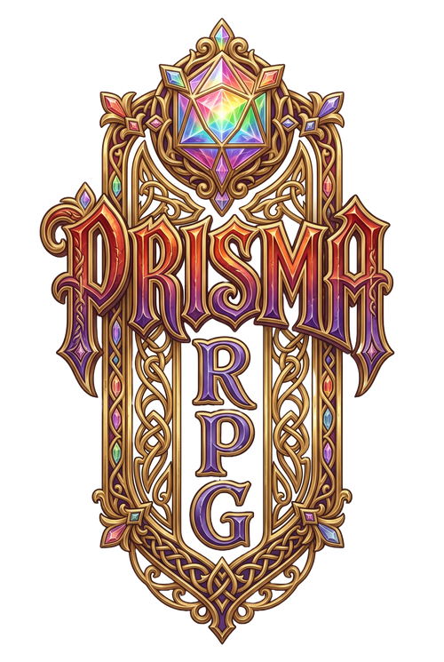

  

# Prisma RPG

> Um d100 de mesa sem classes, onde todas as habilidades do jogo estão disponíveis para qualquer personagem — e onde a força de um golpe é escolha do jogador, não resultado do dado.

**Versão 0.2** — jogável de ponta a ponta: regras completas, 754 habilidades e um Livro do Mestre com bestiário, encontros e recompensas. Ainda não foi testado em mesa.

## O que faz este sistema diferente

**Sem classes.** Não existe "lista de magias do mago" nem "manobras do guerreiro". As 754 habilidades estão abertas a todo mundo desde o nível 1, e a sua build é a soma das dez escolhas que você faz ao longo da campanha.

**Magia e técnica têm a mesma ficha.** Um golpe de espada e uma bola de fogo custam [Mana](jogar/mana.md), gastam [Pontos de Ação](jogar/combate.md#pontos-de-acao) e resolvem igual. Não há dois sistemas pra aprender.

**A força do golpe é decisão, não sorte.** Toda habilidade existe em três [Intensidades](habilidades/regras.md#intensidade), e você escolhe qual pagar **antes de rolar** — 1, 2 ou 3 ◈, com o Mana subindo junto. O d100 só responde se acertou. Como são 3 ◈ por turno, a pergunta é sempre a mesma: um golpe grande, ou três pequenos?

## Por onde começar

| Você é… | Comece por |
|---|---|
| **novo no sistema** | [Jogando o Jogo](jogar/index.md) — o ritmo da mesa e um turno inteiro com números reais |
| **pronto pra montar um personagem** | [Criação de Personagem](criacao/index.md) — cinco passos até uma ficha jogável |
| **quem vai mestrar** | [Livro do Mestre](mestre/index.md) — criaturas prontas, encontros calibrados, o que pedir num teste |
| **procurando uma regra específica** | [Glossário](glossario.md) — condições, tipos de dano, termos de resolução |

## O que já existe

| | |
|---|---|
| **754** habilidades | marciais, mágicas por elemento, sociais, infiltração, mobilidade, buff, debuff, suporte |
| **62** armas | cada uma com 3 habilidades próprias (186 no total), tipo de dano e preço |
| **25** raças | todas com traço físico inconfundível — nenhuma é "humano com poderes" |
| **11** elementos | cada um com assinatura mecânica própria — Fogo consome, Gelo trava, Sombras nega terreno |
| **5** peças de Livro do Mestre | Bestiário, Encontros, Testes, Recompensas, Exploração |

## Navegue

**[Jogando o Jogo](jogar/index.md)** — o que qualquer um na mesa precisa saber

- [Os Oito Atributos](jogar/atributos.md) · [Testes de d100](jogar/testes.md) · [Combate](jogar/combate.md)
- [Mana](jogar/mana.md) · [Dano e Cura](jogar/dano-e-cura.md) · [Condições](jogar/condicoes.md)
- [Estresse](jogar/estresse.md) · [Exploração](jogar/exploracao.md)

**[Criação de Personagem](criacao/index.md)** — os cinco passos

- [Progressão de Nível](criacao/progressao.md)

**[Compêndio](compendio/index.md)** — tudo o que se escolhe, em listagens filtráveis

| Listagem | Filtre por |
|---|---|
| [**Habilidades**](habilidades/index.md) — 754 | grupo, elemento, arma, atributo, alvo, Mana disponível |
| [**Raças**](racas/index.md) — 25 | leva, atributos concedidos, nº de traços |
| [**Origens**](origens/index.md) — 60 | eixo, tipo de traço, atributo — com sorteio 1d20 |
| [**Equipamento**](equipamento/index.md) — 68 | estilo, família, tipo de dano, propriedade, prata disponível |

As regras de cada um: [Habilidade](habilidades/regras.md) · [Equipamento](equipamento/regras.md)

**[Livro do Mestre](mestre/index.md)**

- [Bestiário](bestiario/index.md) — as criaturas prontas, filtráveis por tier, couraça e PA
- [Criando uma Criatura](mestre/criando-criaturas.md) · [Montagem de Encontro](mestre/encontros.md)
- [Testes e Dificuldades](mestre/testes.md) · [Recompensas](mestre/recompensas.md) · [Exploração na Mesa](mestre/exploracao.md)

---

*Sistema homebrew autoral de Paulo Souza. Inspirado em tom e sensação por Mushoku Tensei, Sword Art Online, Fabula Ultima, Skyrim, Dragon Age, The Witcher, Diablo, Warcraft, animes em geral e Grand Chase — o mundo é próprio, não é nenhuma dessas franquias.*
