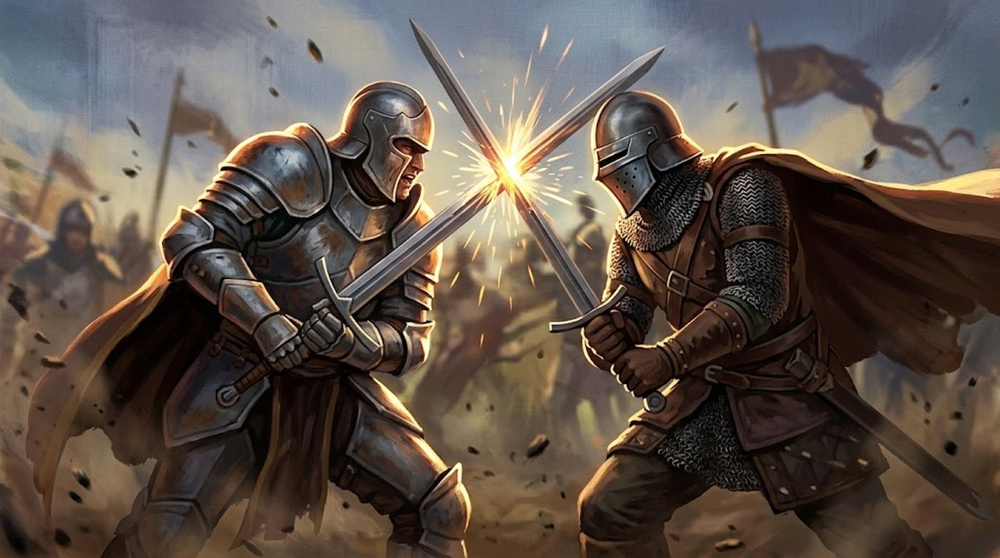

# Combate

| Resumo rápido | |
|---|---|
| Iniciativa | **d100 + Agilidade + Sorte** |
| Pontos de Ação por turno | **3 (◈◈◈)** |
| Movimento | **6 + (Agilidade ÷ 10)** casas, mínimo 1 |
| Ataque | d100 + Atributo vs Evasão (ou outro número-alvo, ver [Defesa](#defesa)) |
| Reação | máximo **1 por rodada**, não importa quanto ◈ sobrou |

Combate é o modo de jogo em que o tempo é contado. A cena vira uma sequência de **rodadas**; dentro de cada rodada, cada participante joga um **turno**; e dentro do turno você tem **3 Pontos de Ação (◈)** pra gastar como quiser.

!!! regra "Em uma frase"
    Role Iniciativa, e no seu turno gaste 3 ◈ entre mover, atacar e usar habilidades — pagando em ◈ a [Intensidade](../glossario.md#intensidade) de cada habilidade, e rolando d100 + Atributo contra a **Evasão** do alvo.

## Iniciativa

  

    
<svg viewBox="0 0 24 24" style="width:9px; height:9px; transform:rotate(-45deg); color:#faf7ef;" fill="none" stroke="currentColor" stroke-width="1.8" stroke-linecap="round" stroke-linejoin="round"><path d="M13 2 4 14h6l-1 8 9-12h-6z"/></svg>

    
Iniciativa

    
Agi+Sorte

  

No início do combate, cada participante rola **d100 + [Agilidade](atributos.md) + [Sorte](atributos.md)**. A ordem decrescente do resultado define a sequência de turnos.

Quem reage rápido age antes — a Agilidade é o reflexo, e a Sorte é estar olhando pro lado certo na hora.

Empate é resolvido por quem tem Agilidade mais alta; persistindo, por quem tem Sorte mais alta; e se ainda empatar, o Mestre decide.

A ordem vale pro combate inteiro — não se rola de novo a cada rodada.

## Turno e rodada

- **[Turno](../glossario.md#turno)** — a vez de **um** participante agir: seus 3 ◈, suas Reações pendentes, seus efeitos "no início/fim do turno".
- **[Rodada](../glossario.md#rodada)** — um ciclo completo da ordem de Iniciativa; termina quando **todos** jogaram. Um efeito de "X rodadas" expira **no início do turno de quem o criou**, X rodadas depois da ativação.
- **[Cena](../glossario.md#cena)** — um combate é sempre uma cena própria: usos "por cena" resetam quando ele termina.

## Pontos de Ação (◈)

Cada personagem tem **3 Pontos de Ação (◈◈◈)** por turno. Quase tudo custa PA.

| Ação | Custo |
|---|---|
| Movimento | ◈ (1) |
| Ação Básica | ◈ (1) |
| Ataque Básico | ◈ (1) |
| Habilidade | a [Intensidade](#custo-em-pa-de-habilidades) escolhida — ◈, ◈◈ ou ◈◈◈ |
| Reação | o custo normal da habilidade usada (0 se for dedicada) — consome do mesmo pool |

**Ataque Básico** funciona com qualquer arma equipada, mesmo uma cujas Habilidades o personagem nunca aprendeu — causa o dado de dano da arma, sem nenhum efeito extra. É o que permite "ter uma arma na mão" desde o nível 0 sem precisar gastar uma Habilidade nela (ver [Criação de Personagem](../criacao/index.md)).

**Ação Básica** é tudo o que não tem ficha própria e leva um instante: abrir uma porta, sacar um item, gritar uma ordem, [estabilizar um aliado](dano-e-cura.md#chegando-a-0-de-vida).

### Custo em PA de Habilidades

O custo em PA de uma Habilidade **é a Intensidade escolhida** — não um valor fixo por habilidade. Isso vale igualmente para habilidades de arma e habilidades gerais de grupo:

| PA | Intensidade | O que ela entrega |
|---|---|---|
| ◈ (1) | I | O efeito base — normalmente só o dano |
| ◈◈ (2) | II | Acrescenta o efeito secundário (empurrar, Sangrando, Marcado) |
| ◈◈◈ (3) | III | O efeito completo (derrubar, Atordoado) |

Como o pool é de 3 PA por turno, isso vira uma decisão a cada turno: **uma habilidade em Intensidade III consome o turno inteiro** (sem movimento, sem reação guardada), enquanto três usos em Intensidade I fazem muito mais coisa por muito menos efeito cada. Ver [Intensidade](../glossario.md#intensidade).

Vale igualmente para buffs, cura e mobilidade: não há teste de ataque neles, mas há Intensidade — o que cresce é o tamanho do efeito, não a chance de acertar (ver [Buffs, Suporte e Mobilidade](../habilidades/regras.md#buffs-suporte-e-mobilidade-tambem-tem-intensidade)).

!!! regra "Exceções — habilidades de Custo fixo"
    Áreas de 3 casas de raio ou mais, Supremas, e efeitos absolutos que não têm degrau acima (uma Reação que anula um ataque por completo) cobram um valor fixo de PA e entregam um único resultado.

### Reações

!!! regra "Limite: 1 Reação por rodada"
    Não importa quanto PA sobrou nem quantos gatilhos apareceram — o personagem reage **no máximo uma vez** até o início do próprio próximo turno. O limite vale igual pra qualquer Reação, inclusive as dedicadas, e não muda mesmo com PA de sobra guardado.

**Qualquer Habilidade pode ser usada como Reação**, fora do seu turno, desde que o personagem ainda tenha PA sobrando no pool (do turno anterior) pra pagar o custo normal dela. O sistema é deliberadamente livre nesse ponto — se o jogador guardou PA, pode reagir com o que quiser, não só com uma lista fixa de "habilidades de reação". Isso é só **o que** você pode usar como Reação, não quantas vezes — o limite acima continua valendo.

**Habilidades dedicadas a Reação** (o texto diz explicitamente "usada como Reação", ex: Defesa Mágica, Cambalhota) são a exceção de custo: custam **0 PA — só Mana**. Ficam disponíveis mesmo se o personagem já gastou todo o PA no próprio turno — mas ainda contam pro limite de 1 por rodada. Nelas, a Intensidade escolhe só quanto Mana gastar.

Um efeito que faça o alvo [perder a próxima Reação](../glossario.md#perde-a-proxima-reacao) nega até as dedicadas.

## Movimento

  

    
<svg viewBox="0 0 24 24" style="width:9px; height:9px; transform:rotate(-45deg); color:#faf7ef;" fill="none" stroke="currentColor" stroke-width="1.8" stroke-linecap="round" stroke-linejoin="round"><path d="M4 12h13M13 6l6 6-6 6"/></svg>

    
Movimento

    
6+Agi÷10

  

**Movimento base = 6 casas + (Agilidade ÷ 10)**, arredondado (valor com sinal). Mínimo de movimento: **1 casa**.

"Casas" é uma unidade abstrata — o mapa pode usar quadrados ou hexágonos.

O jogo **não tem regra de orientação** (facing): quando uma habilidade fala em "à frente" ou "pra trás", leia como **na direção do alvo** e **na direção oposta ao alvo** (ou ao atacante, no caso de uma Reação).

[Terreno Difícil](../glossario.md#terreno-dificil) cobra o dobro por casa. Deslocamento forçado — [empurrar e puxar](../glossario.md#empurrar-e-puxar) — não é movimento do alvo, e por isso funciona contra quem está [Imóvel](../glossario.md#imovel).

### Voo

Quem pode voar (traço racial ou habilidade) se move em três dimensões pelo **mesmo custo de Movimento** — cada casa de altura conta como uma casa andada.

- **Alcance:** corpo a corpo só alcança quem voa a 1 casa de altura; acima disso, só ataques à distância (e o voador enxerga por cima de obstáculos baixos).
- **Queda:** quem fica [Atordoado](../glossario.md#atordoado) ou é derrubado no ar **despenca**: sofre dano de Impacto (ver [Dano Improvisado](estresse.md#tabelas-de-referencia-rapida)) a cada 2 casas de altura e aterrissa [Derrubado](../glossario.md#derrubado).
- [Imóvel](../glossario.md#imovel) no ar: para de se deslocar, mas plana no lugar — não cai.

## Quem rola o dado

!!! regra "Quem age, rola"
    Isso vale nos dois sentidos e é a única regra de resolução do jogo:

- O personagem ataca uma criatura → **o jogador** rola d100 + Atributo contra a Evasão da criatura.
- Uma criatura ataca o personagem → **o Mestre** rola d100 + o Ataque da criatura contra a Evasão do personagem.

Não existe rolagem de defesa: quem está sendo atacado não rola nada, seu número de Evasão é o alvo a ser superado. Ver [Bestiário](../mestre/criando-criaturas.md#como-resolver-o-ataque-de-uma-criatura) para o lado do Mestre.

## Defesa

  

    
<svg viewBox="0 0 24 24" style="width:9px; height:9px; transform:rotate(-45deg); color:#faf7ef;" fill="none" stroke="currentColor" stroke-width="1.8" stroke-linecap="round" stroke-linejoin="round"><path d="M3 6l6 6-6 6"/><path d="M11 6l6 6-6 6"/></svg>

    
Evasão

    
Agi+Escudo/Couraça

  

Um golpe físico não é resistido pelo mesmo número que resiste a um veneno ou a um controle mental — cada tipo de efeito testa uma coisa diferente, sempre o valor **cru** do atributo (sem nenhum bônus fixo de Tier somado por baixo):

| Tipo de efeito | Número-alvo | De onde vem |
|---|---|---|
| Físico (dano, empurrar, derrubar) — padrão, decide se o golpe **acerta** | **Evasão** | Agilidade + Escudo/Couraça Natural |
| Controle mental de origem **mágica**, maldição | **Fortitude Mágica** | o próprio valor de Magia |
| Manipulação **social** — persuadir, enganar, intimidar (e resistir a tudo isso) | **Social** | o próprio valor de Social |
| Veneno, doença, exaustão, petrificação — efeito que o corpo resiste por dentro, não desvia | **Fortitude Física** | o próprio valor de Defesa |
| Horror, insanidade, colapso mental | **Sanidade** | o próprio valor de Sanidade |
| Furtividade, detecção — perceber um roubo, notar algo escondido | **Exploração** | o próprio valor de Exploração |

Essa lista não é fechada — cresce conforme habilidades novas pedirem.

A **Evasão** decide **se** o golpe acerta, nunca o quanto ele faz — isso já foi decidido pela [Intensidade](../glossario.md#intensidade) paga. Por isso a Evasão do alvo pesa na escolha de quanto investir: contra um alvo com Evasão alta, gastar 3 PA e o Mana de uma Intensidade III num único ataque é uma aposta alta — se errar, perde tudo e o turno inteiro. Contra alvos fracos, a mesma Intensidade III praticamente não erra.

!!! nota "Por que não existe mais uma Base de Resiliência somada aqui"
    No sistema antigo, um valor fixo por Tier (Base de Resiliência) somava em cima do atributo — porque o atributo sozinho era pequeno demais pra sustentar a conta sozinho. Agora que o jogador investe pontos de verdade e o atributo chega a 100, o atributo **já carrega o peso todo**: manter uma base fixa por cima diluiria a escolha de investimento. O Tier de uma criatura ainda importa — só que agora ele orienta que **valores** o Mestre escreve na ficha dela (ver [Bestiário](../mestre/criando-criaturas.md)), não soma como bônus formal.

## Fim do combate

Uma criatura que chega a 0 de Vida **morre** (ver [Bestiário](../mestre/criando-criaturas.md#criatura-a-0-de-vida-morre)). Um personagem jogador, não: ele fica [Caído](dano-e-cura.md#chegando-a-0-de-vida) e passa a rolar contra a morte — a menos que escolha o [Último Turno](dano-e-cura.md#o-ultimo-turno).
