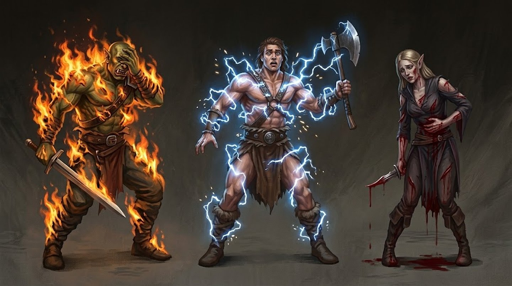

# Condições

Uma condição é um estado que muda o que uma criatura consegue fazer — imposta por uma habilidade, por uma armadilha ou pelo próprio ambiente.

Duas coisas valem pra qualquer uma:

- **A rolagem de acerto decide se a condição entra, não o quanto ela pesa.** O tamanho e o alcance do efeito vêm da [Intensidade](../glossario.md#intensidade) paga antes de rolar.
- **Efeitos que dão número não somam entre si** — ver [Acúmulo de bônus](../glossario.md#acumulo-de-bonus).

Os verbetes abaixo são os mesmos do [Glossário](../glossario.md), que continua sendo a fonte. Estão reunidos aqui pra consulta durante o combate.
