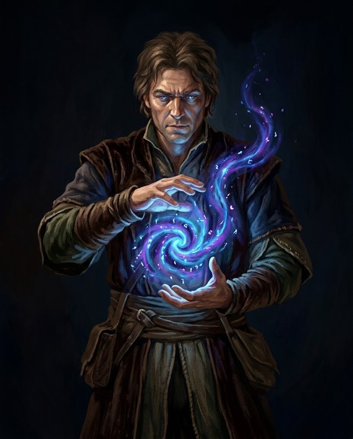

# Mana

| Resumo rápido | |
|---|---|
| Mana Máximo | **20 + Nível + (Magia × 2)** + Mana de equipamento |
| Recuperação | metade no descanso curto, tudo no longo |
| Custo por Intensidade (habilidade geral) | **3 / 9 / 18** Mana (I / II / III) |
| Custo por Intensidade (habilidade de arma) | varia pelo grau — ver [Escala de Mana](#escala-de-mana-por-intensidade) |
| Requisito suave de Atributo | abaixo do recomendado pra Escala, rola com Desvantagem |

Recurso universal que alimenta todas as habilidades do personagem — marciais, mágicas, sociais, etc. Não existe um recurso separado para "magia": tudo usa Mana.

Enquanto os [Pontos de Ação](../glossario.md#pontos-de-acao) são o orçamento **do turno**, o Mana é o orçamento **do dia**. É ele que decide se você aguenta mais um combate antes de precisar parar.

## Mana Máximo

  

    
<svg viewBox="0 0 24 24" style="width:10px; height:10px; transform:rotate(-45deg); color:#faf7ef;" fill="none" stroke="currentColor" stroke-width="1.8" stroke-linecap="round" stroke-linejoin="round"><path d="M12 2c4 5 7 9 7 12a7 7 0 0 1-14 0c0-3 3-7 7-12z"/></svg>

    
Mana

    

Atual

&nbsp;

Máx

&nbsp;

  

**Mana Máximo = 20 (base) + Nível + (Magia × 2) + Mana de equipamento**

Mesma forma da [Vida Máxima](../glossario.md#vida) (só trocando Defesa por Magia) — de propósito: Mana não devia parecer um recurso secundário perto da Vida, os dois crescem no mesmo tamanho. Exemplo: nível 0, Magia 5 (baseline de criação) → 20+0+10 = 30 Mana. Nível 100, Magia 98 (foco em Magia) → 20+100+196 = 316 Mana — mais até que a Vida de um personagem assim (frágil de corpo, carrega poder de sobra).

O termo de equipamento é 0 pra quase tudo — hoje só as [Roupas Místicas](../equipamento/index.md#equ-roupas-misticas) somam algo (+15).

Mana continua sendo um recurso universal — até quem não investe em Magia acumula uma boa reserva só pelo lado do Nível, porque golpes marciais também custam Mana.

!!! nota "Os custos de habilidade já foram reequilibrados"
    A fórmula do *pool* cresce com o Nível sozinha, mesmo sem investir em Magia — então os custos fixos em Mana (tabela abaixo) precisaram subir junto, ou ficariam triviais lá pela metade da carreira. Todos os custos de Mana do jogo (armas e habilidades gerais) foram multiplicados por **×3** em cima do valor original do sistema d20.

## Recuperação

- **Descanso curto** (cerca de 1 hora): recupera **metade** do Mana máximo
- **Descanso longo** (uma noite de sono em lugar seguro): recupera **todo** o Mana

Ver [Descanso](exploracao.md#descanso) para o que mais cada um recupera, e por que descanso longo exige segurança.

## Escala de Mana por Intensidade

Mana e Pontos de Ação sobem **juntos** com a [Intensidade](../glossario.md#intensidade): empurrar uma habilidade mais longe consome mais do turno *e* mais Mana. A Intensidade I de qualquer habilidade é sempre barata; a III pesa de verdade no orçamento.

**Habilidades de arma** seguem uma escala fixa pelo grau, então o investimento na arma continua visível — uma Especial custa mais que uma Básica na mesma Intensidade:

| Grau da arma | Intensidade I (◈) | Intensidade II (◈◈) | Intensidade III (◈◈◈) |
|---|---|---|---|
| Básica | 3 Mana | 9 Mana | 18 Mana |
| Avançada | 6 Mana | 15 Mana | 27 Mana |
| Especial | 9 Mana | 21 Mana | 36 Mana |

**Habilidades gerais de grupo** usam a escala regular **3 / 9 / 18 Mana**. As que foram precificadas acima disso (por serem mais fortes que a média do grupo) mantêm o próprio custo e escalam em passos de **+9 Mana por Intensidade** — ex: 6/15/24, 9/18/27, 12/21/30.

Habilidades de **Custo fixo** (áreas de raio 3+, Supremas, e efeitos absolutos sem degrau) cobram o valor da Intensidade III, já que entregam o efeito completo. **Buffs, cura e mobilidade têm Intensidade normalmente** — o que escala é o tamanho do efeito (ver [Buffs, Suporte e Mobilidade também têm Intensidade](../habilidades/regras.md#buffs-suporte-e-mobilidade-tambem-tem-intensidade)); só ficam com Custo fixo os que não têm nada pra graduar. Habilidades **dedicadas a Reação** custam 0 PA e só Mana (ver [Reações](combate.md#reacoes)).

## Grau de Poder

Classificação geral de quão forte uma habilidade é, usada pra precificar qualquer habilidade nova. Mede o **teto** da habilidade — o custo da Intensidade III dela:

| Grau de Poder | Custo em Mana | Uso esperado |
|---|---|---|
| Menor | 3–9 | Várias vezes por combate (ex: Intensidade I de técnicas de arma) |
| Moderado | 12–24 | 2–4 vezes por descanso |
| Maior | 27–45 | 1–2 vezes por descanso |
| Supremo | 48+ | 1 vez por descanso, possivelmente com restrição extra (ex: voo sustentado, invocar demônio, controle mental total) |

!!! exemplo "Filtrando pelo que você consegue pagar"
    A [Listagem de Habilidades](../habilidades/index.md) tem um controle de **Mana disponível**: arraste até o seu total atual e ela esconde tudo o que você não teria como ativar.

## Requisito suave de Atributo

Escala de arma e Grau de Poder também servem de guia pra quanto de Atributo o personagem devia ter pra usar aquela habilidade **sem desvantagem** — não é um bloqueio (qualquer habilidade continua acessível desde o nível 0), é um incentivo a investir:

| Escala | Atributo recomendado |
|---|---|
| Básica (arma) | 15 |
| Avançada (arma) | 35 |
| Especial (arma) | 55 |
| Menor (geral) | 20 |
| Moderado (geral) | 40 |
| Maior (geral) | 65 |
| Supremo (geral) | 85 |

**Abaixo do recomendado, a rolagem é feita com [Desvantagem](testes.md#vantagem-e-desvantagem)** (2d100, fica com o pior); no recomendado ou acima, rola normal. Um Supremo continua utilizável desde cedo — só que arriscado, até o Atributo acompanhar.
