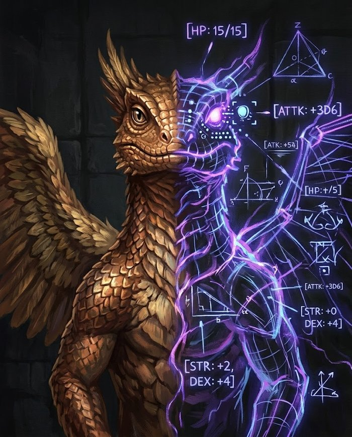

# Criando uma Criatura



Como ler uma ficha, e como montar as suas.

## Como Ler uma Ficha de Criatura

Criatura não é personagem: ela não sobe de nível, não distribui pontos e não precisa de ficha completa. O que define uma criatura é o **[Tier de Ameaça](../jogar/combate.md#defesa)** — e dele saem quase todos os números dela.

| Tier | Vida | Pontos de Ação | Ficha | Ataques |
|---|---|---|---|---|
| **Comum** | 14 | ◈◈ (2) | só os atributos relevantes | custo fixo |
| **Treinado** | 44 | ◈◈◈ (3) | só os atributos relevantes | custo fixo |
| **Formidável** | 105 | ◈◈◈◈ (4) | os 8 atributos | com [Intensidade](../glossario.md#intensidade) + Mana |
| **Lendário** | 315 | ◈◈◈◈◈ (5) + Ação de Lenda | os 8 atributos | com Intensidade + Mana |

### Como resolver o ataque de uma criatura

**Quem age, rola** — vale pra criatura do mesmo jeito que vale pro personagem. Quando a criatura ataca, **o Mestre rola**:

**d100 + o Ataque da criatura vs a Evasão do personagem.**

Cada ficha traz o **Ataque** já como o valor do atributo, pra você não precisar somar nada na hora. A Evasão do personagem vem da ficha dele: **Evasão = Agilidade + Escudo** (ver [Defesa](../glossario.md#defesa)).

- O **limiar de Crítico** da criatura (Sorte ÷ 3) funciona igual ao de um personagem: rolar igual ou abaixo dele é sucesso automático e crítico — **dano máximo dos dados + uma rolagem extra**. Criatura **não** sobe de Intensidade no crítico — esse bônus é dos personagens.
- Ataque que impõe efeito mental, veneno ou medo é comparado ao número-alvo certo — **Fortitude Mágica** (controle mágico), **Social** (manipulação não-mágica), **Fortitude Física** (veneno, doença), **Sanidade** (horror) ou **Exploração** (percepção) — nunca à Evasão. A ficha da criatura diz qual.

**Como ler a linha de um ataque.** Cada ataque vem escrito assim:

```
Mordida — ◈ | +10 vs Evasão | 1 criatura adjacente
```

Isso é, na ordem: o **custo em PA** (◈), o **bônus que o Mestre soma no d100** e contra qual **número-alvo** comparar, e quem pode ser **alvo**. No caso: gasta 1 PA, role d100+10 contra a Evasão do alvo, atingindo uma criatura adjacente.

### O tipo de dano vale nos dois lados

O tipo de dano de um ataque **não impõe efeito nenhum** — o que a criatura faz é o que a ficha
dela diz. Mas o tipo é uma boa **fonte de ideias** na hora de escrever o ataque: um golpe merece
o efeito que o tipo dele sugere, quando o conceito do bicho pede.

| Se o ataque é… | costuma render |
|---|---|
| **Cortante** | garras e presas que rasgam — deixe o alvo [Sangrando](../glossario.md#sangrando) |
| **Impacto** | coice, cauda, martelo — derrube, ou deixe [Lento](../glossario.md#lento) |
| **Perfurante** | chifre, ferrão, bicada — dano extra contra alvo já preso |

Isso é diretriz, não obrigação: um lobo que só morde e um urso que só esmaga estão certos sem
efeito nenhum além do dano. Escreva o efeito quando ele **for** o bicho — a mordida do Troll que
não para de sangrar, o coice do Gigante que joga o personagem no chão.

!!! regra "O tipo pesa mesmo é na Resistência"
    Escolher o tipo do ataque decide contra quem ele funciona mal. Uma criatura
    [Resistente](../glossario.md#resistencia) a um tipo sofre metade do dano **e não sofre o
    efeito característico dele** — resistente a Cortante não sangra, a Impacto não é derrubado
    nem fica Lento, a Perfurante não leva o dano extra. Ver
    [Tipos de Dano Físico](../jogar/regras-de-equipamento.md#tipos-de-dano-fisico).

    Isso pesa dos dois lados: dar Resistência aos três tipos físicos (Enxame, Sombra, Carniçal)
    deixa qualquer arma física quase inútil contra a criatura — de propósito, mas quem monta
    bicho precisa saber.

### Um turno jogado

O [Dragão Filhote](../bestiario/index.md#bes-dragao-filhote) (Ataque **+53**, 4 PA, 158 Mana) está à frente de dois personagens: a **Guerreira** (Evasão **50**) e o **Mago** (Evasão **80** — ágil e difícil de acertar).

**O Mestre escolhe a Baforada em Intensidade II:** gasta **2 PA** e **15 Mana**, sobrando 2 PA e 143 Mana.

1. **Quem é alvo?** A Baforada em Intensidade II é um cone de 3 casas à frente. Os dois estão dentro, então os dois são alvos.
2. **Rola o dado:** sai **60** no d100. Somando o Ataque +53, o total é **113**. Uma rolagem só, comparada com cada alvo.
3. **Compara com cada Evasão:**

| Alvo | Evasão | Comparação | Resultado |
|---|---|---|---|
| Guerreira | 50 | 113 ≥ 50 | **acertou** — 4d10 de dano, e fica [Queimando](../glossario.md#queimando) |
| Mago | 80 | 113 ≥ 80 | **acertou** — 4d10 de dano, e fica [Queimando](../glossario.md#queimando) |

4. **O efeito extra não precisa de rolagem.** A Intensidade II espalha o fogo para 1 criatura adjacente a cada alvo atingido: se o Ladino estiver ao lado da Guerreira, ele pega fogo automaticamente. Espalhamento não é ataque, então não há d100.
5. **Ainda sobraram 2 PA.** O Dragão usa **Garras e Presas** (◈, 0 Mana) na Guerreira: rola de novo, sai 40 → 40+53 = **93** contra a Evasão 50, acerta, mais 4d10.
6. **No turno seguinte da Guerreira**, ela perde dano de Fogo pelo Queimando antes de agir — e vai continuar perdendo até alguém apagar o fogo.

**O que limitou as escolhas do Mestre:** o **PA** decide quantas coisas ele faz no turno (Baforada III sozinha consome só 3 dos 4; ainda sobra pra mais uma Garras e Presas). O **Mana** decide quantas vezes na luta inteira — mesmo com 158 de Mana, a Intensidade III da Baforada (22 Mana) só cabe umas 7 vezes antes de secar. É justamente por isso que **Garras e Presas custa 0 Mana**: é o ataque de rotina que mantém o chefe relevante depois de gastar o combustível.

### Criatura a 0 de Vida morre

Personagens ficam [Caídos](../jogar/dano-e-cura.md#chegando-a-0-de-vida) e rolam contra a morte. **Criaturas não**: chegou a zero, acabou. Nenhuma rolagem, nenhum turno de agonia.

É o que impede a mesa de travar — oito goblins derrotados seriam oito contagens paralelas pra você administrar. E preserva o peso da regra: rolar contra a morte é privilégio de quem tem nome.

!!! mestre "Exceção que vale usar"
    Um chefe ou NPC importante pode ficar Caído como um personagem, se você quiser a chance de capturá-lo vivo, ou o drama de vê-lo se arrastar. Aí é escolha sua, anunciada na hora — não regra.

### Vida é valor fixo

Sem rolagem: abra a ficha e use o número. Os valores desta tabela valem pra personagens de **nível 0 a 25** — grupos mais fortes usam a [Vida por faixa de nível](encontros.md#vida-por-faixa-de-nivel). A Vida foi calibrada contra o dano real que um grupo entrega: um **Comum cai em um ou dois golpes**, um **Treinado** aguenta 2-3, um **Formidável** absorve mais ou menos uma rodada inteira de um grupo de 4, e um **Lendário** dura 3-5 rodadas.

### Pontos de Ação por Tier

Um personagem tem 3 ◈. Uma criatura **Comum tem 2**: ela **move e ataca**, que é o mínimo que qualquer coisa viva faz numa rodada. Agir uma vez só é característica de bicho lento — e isso é traço da criatura, não regra do Tier.

Um **Treinado tem 3**, os mesmos de um personagem: a partir daí ele é um oponente, não um obstáculo. **Formidável tem 4** e **Lendário tem 5**, mais a Ação de Lenda — são os seres capazes de agir além do que um corpo treinado consegue.

O preço disso é tempo de mesa: oito Comuns geram dezesseis ações por rodada. O limite prático de oito criaturas na sala (ver [Montagem de Encontro](encontros.md#mais-de-8-criaturas-travam-a-mesa)) fica mais apertado, não menos — quando o orçamento pedir muitos corpos, troque quantidade por Tier.

### Couraça Natural

O bônus que faltava ser definido na [tabela de Defesa](../jogar/combate.md#defesa). Soma **só na Evasão** (dano, empurrar, derrubar) — não protege contra veneno, medo ou ilusão:

| Couraça | Bônus | Exemplo |
|---|---|---|
| Nenhuma | +0 | pele nua, tecido, gente comum |
| Coriácea | +5 | couro curtido, pelagem densa, pele grossa |
| Escamada | +10 | escamas, carapaça de quitina, cota de malha |
| Blindada | +15 | placas ósseas, armadura de placas, casco pesado |
| Dracônica | +20 | escamas de dragão adulto, pedra viva, aço encantado |

- **Evasão** = Agilidade + Couraça Natural
- Efeito que pula a Evasão usa o número-alvo certo — Fortitude Mágica, Social, Fortitude Física, Sanidade ou Exploração — nunca soma Couraça.

### Ataques: capangas são fixos, chefes decidem

**Comum e Treinado** têm ataques de **custo fixo**, sem Mana: o Mestre lê a linha e rola. É o que permite rodar oito capangas sem administrar oito reservas de recurso.

**Formidável e Lendário** são chefes: têm **Mana** e usam [Intensidade](../glossario.md#intensidade) como um jogador — o Mestre decide se gasta 1 PA num golpe rápido ou queima o turno inteiro numa Intensidade III. É onde a decisão tática vale a pena, porque é uma criatura só.

### Ação de Lenda

Exclusiva do Tier Lendário: **uma vez por rodada, fora do próprio turno**, a criatura pode usar uma habilidade sua pagando o custo normal. É o que evita que um Lendário sozinho seja simplesmente cercado e morto sem reagir — ele responde no turno dos personagens.

---

## Montando a sua

Você não precisa calcular nada: escolha o Tier e copie a coluna.

### Tabela de construção

| | Comum | Treinado | Formidável | Lendário |
|---|---|---|---|---|
| **Vida** (nível 0–25) | 14 | 44 | 105 | 315 |
| **Pontos de Ação** | ◈◈ (2) | ◈◈◈ (3) | ◈◈◈◈ (4) | ◈◈◈◈◈ (5) + Ação de Lenda |
| **Ataque** (o próprio atributo) | 10 a 20 | 20 a 35 | 35 a 55 | 55 a 85 |
| **Dano por ataque** | 1d6 – 2d6 | 2d8 | 2d12 | 2d20 – 3d20 |
| **Mana** | — | — | 70 + Magia×2 | 110 + Magia×2 |
| **Couraça típica** | +0 a +5 | +5 a +10 | +10 a +15 | +15 a +20 |
| **Atributo secundário** | 10 a 20 | 20 a 30 | 30 a 45 | 45 a 65 |
| **Traços especiais** | 1 | 1 a 2 | 2 a 3 | 3 a 4 |

Para grupos acima do nível 25, troque a linha de Vida pela [Vida por faixa de nível](encontros.md#vida-por-faixa-de-nivel). Todo o resto continua igual.

No **Ataque**, use o topo da faixa quando a criatura for precisa ou treinada, e o piso quando for desajeitada ou lenta.

**Custo em Mana das ações** (só Formidável/Lendário, que têm Mana): use a mesma escala das
habilidades gerais de personagem, direto — Menor 3-9, Moderado 12-24, Maior 27-45, Supremo
48+ (ver [Faixas de Mana](../jogar/mana.md#faixas-de-mana)). Criatura e personagem usam os
mesmos números — nenhuma conversão à parte. Na prática, **Formidável** fica em Moderado
(12-24, tipicamente 15-22), e **Lendário** em Maior (27-45, tipicamente 30-45); nenhuma
criatura do Bestiário usa Supremo — esse teto é reservado pro pico de poder tardio de
personagem. É a mesma escala já usada nas 30 fichas Formidável/Lendário do Bestiário.

!!! mestre "Esta tabela monta criatura nova — ela não descreve as do Bestiário"
    A tabela é **andaime**: serve pra você ter números em trinta segundos quando inventa um bicho na hora. As criaturas do [Bestiário](../bestiario/index.md) **não** obedecem a ela, e é de propósito.

    Um [Stirge](../bestiario/index.md#bes-stirge) tem Vida baixa e um [Zumbi](../bestiario/index.md#bes-zumbi) tem bem mais — os dois são **Comuns**. Um [Golem de Ferro](../bestiario/index.md#bes-golem-de-ferro) e o [Tarrasque](../bestiario/index.md#bes-tarrasque) são os dois **Lendários**, com Vidas bem diferentes. O que decide o número é **o que a criatura é**, não a linha da tabela: um zumbi *tem* que ser um saco de carne difícil de derrubar, e uma sanguessuga voadora *tem* que morrer no primeiro acerto.

    **Na ficha, o número é o número.** As fórmulas (Agilidade + Couraça) montam uma criatura do zero; elas não recalculam as que já existem. Se a ficha diz Evasão 60, é 60.

O **Tier** continua mandando em três coisas, e essas não variam: quantos **◈** a criatura tem, se ela usa **Mana e Intensidade**, e quanto ela custa em [Pontos de Ameaça](encontros.md#pontos-de-ameaca). Ele responde *"quanta atenção esse bicho merece na mesa"* — não *"quantos pontos de Vida ele tem"*.

### Os cinco passos

**1. Escreva o conceito em uma frase.** Não os números — a frase. *"Ele não ataca o mais forte do grupo, ataca o que se afastou."* Tudo depois disso é consequência dela: se o conceito é caçar quem se separou, o bicho precisa de Movimento alto e de um bônus contra alvo isolado.

**2. Escolha o Tier pela função na cena, não pelo tamanho do bicho.** Um urso enorme que serve de obstáculo de estrada é **Treinado**; um assassino humano magro que é o vilão do arco é **Formidável**. O Tier responde "quanto de atenção essa criatura merece nesta mesa", não "quantos quilos ela tem".

**3. Copie a coluna** — Vida, PA, Ataque, dano, Couraça. Calcule a Evasão:
   - **Evasão** = Agilidade + Couraça

**4. Escolha os atributos que a frase pede, e só eles.** Comuns e Treinados listam **apenas o que importa**; o resto vale **0** por omissão (a grade completa sozinha, no card). Um lobo tem Agilidade, Defesa e Exploração (faro) — não precisa de Magia nem Sanidade. Chefes (Formidável e Lendário) listam os 8, porque contra eles os jogadores vão tentar de tudo: charme, medo, veneno, ilusão.

**5. Dê os traços especiais — é aqui que a criatura nasce.** Os números do passo 3 fazem duas criaturas do mesmo Tier serem idênticas; os traços são o que as separa. Um Comum tem 1, um Lendário tem 3 ou 4.

### O que cada campo da ficha faz por você

| Campo | Para que serve na mesa | Vem de |
|---|---|---|
| **Tier** | resume a ameaça e define quase todo o resto | sua escolha |
| **Vida** | quantos golpes a criatura aguenta | tabela, pelo Tier |
| **PA** | quantas coisas ela faz por turno — a primeira medida de ameaça | tabela, pelo Tier |
| **Ataque** | o número que o Mestre soma no d100, já pronto | tabela, ajustado pelo conceito |
| **Evasão** | o alvo que o jogador precisa superar pra acertar | Agilidade + Couraça |
| **Fortitude Mágica / Social / Física / Sanidade / Exploração** | o alvo de efeitos que pulam a Evasão | o próprio atributo, cru |
| **Iniciativa** | bônus somado ao d100 na ordem de turnos | Agilidade + Sorte (a Sorte é 0 na maioria) |
| **Couraça** | só a Evasão; não protege de veneno nem medo | conceito (couro, escamas, placas) |
| **Atributos** | o valor usado quando algo incomum é testado nela | conceito |
| **Movimento** | quantas casas anda por PA gasto | 6 + (Agilidade ÷ 10) |
| **Mana** | só chefes: quantas vezes usam as habilidades boas na luta | tabela, pelo Tier + Magia |

### Três tipos de traço, e o que cada um resolve

Traço é o que transforma estatística em criatura. Pensando no que você quer que aconteça na mesa:

- **Traço que muda o alvo** — faz a criatura ameaçar quem normalmente está seguro. *Matilha* (Vantagem quando cercam), *Bando* (dano extra com aliado adjacente), a Mordida do Lobo derrubando quem está sozinho. Estes forçam o grupo a se reposicionar.
- **Traço que muda a solução** — faz a ferramenta importar mais que o dano. A [Vulnerabilidade](../glossario.md#vulnerabilidade) a Impacto do Esqueleto, a *Divisão* do Slime, uma imunidade a fogo. Estes recompensam preparação e conhecimento.
- **Traço que muda o tempo** — faz a luta não acabar quando parecia. *Remontar* do Esqueleto, cura, invocação de reforços, uma segunda forma. Estes criam clímax, e são os mais fortes: use no máximo um por criatura.

!!! cuidado "Combine no máximo dois"
    Uma criatura com quatro traços não é interessante, é uma ficha que o Mestre esquece de aplicar no meio do combate.

### Exemplo: do conceito à ficha

**Conceito:** *"Uma aranha gigante que não persegue — ela espera na teia, e quem se solta chega machucado."*

Isso pede: um Treinado (obstáculo sério, não vilão), veneno, e algo que prenda. Copiando a coluna Treinado e desviando onde a frase pede:

**Aranha das Cavernas**

*Ela não persegue. Ela espera — e a teia trabalha por ela.*

- **Tier:** Treinado | **Vida:** 44 | **PA:** ◈◈◈ (3) | **Iniciativa:** +5
- **Ataque:** +25 | **Evasão:** 30
- **Atributos:** Agilidade 20, Defesa 25, Exploração 25 | **Couraça:** Escamada (+10, quitina)
- **Movimento:** 8 casas

A Fortitude Física dela é o próprio 25 de Defesa, lido direto da grade — não é um campo à parte.

**Mordida Peçonhenta** — ◈ | +25 vs Evasão | 1 criatura adjacente

- **2d8** de dano ([Perfurante](../glossario.md#perfurante)) + o alvo fica [Envenenado](../glossario.md#envenenado).

**Teia** — ◈ | +25 vs Evasão | 1 criatura a até 6 casas

- O alvo fica [Imóvel](../glossario.md#imovel) até se soltar: gastar uma Ação Básica e sofrer 1d4 de dano ao arrancar a teia.

**Sentinela da Teia** *(passiva)*

- Enquanto estiver na própria teia, a Aranha rola ataques com **Vantagem** e não pode ser derrubada.

Repare no que veio de onde: **Vida, PA, Ataque e dano saíram direto da tabela**. Agilidade 20 (no piso da faixa) veio da frase — ela não persegue, então não precisa ser rápida. A Exploração 25 é a mesma frase de outro jeito: ela sente a vibração da teia. Os dois traços cobrem tipos diferentes: *Teia* muda o alvo (prende quem tentava passar), *Sentinela* muda o terreno (lutar na teia dela é pior). E o veneno não é um terceiro traço — é o dano dela, do tipo que continua depois.
