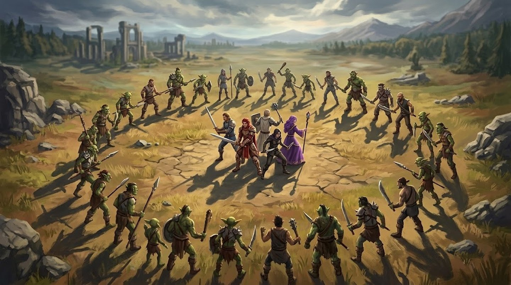

# Montagem de Encontro

Quantas criaturas colocar na sala, e por quê.

## Pontos de Ameaça

**Cada criatura traz o próprio custo na ficha**, no campo **Ameaça**. Some os pontos do encontro e compare com o orçamento do grupo.

Não é um número por Tier: dentro do mesmo Tier um [Sprite](../bestiario/index.md#bes-sprite) custa **2** e um [Enxame de Ratos](../bestiario/index.md#bes-enxame-de-ratos) custa **4**; um [Lich](../bestiario/index.md#bes-lich) custa **40** e um [Tarrasque](../bestiario/index.md#bes-tarrasque) custa **100**. A faixa de cada Tier, pra você ter a ordem de grandeza na cabeça:

| Tier | Ameaça |
|---|---|
| Comum | 2 a 5 |
| Treinado | 5 a 10 |
| Formidável | 15 a 28 |
| Lendário | 40 a 100 |

!!! mestre "De onde sai o número — e como precificar a sua criatura"
    **Ameaça = Vida ÷ 10 + (dano por rodada) ÷ 5**, arredondado, mínimo 1. O *dano por rodada* é o PA da criatura vezes a média do ataque de rotina dela — um Goblin com 2 ◈ e 1d6 faz 7 por rodada.

    Depois disso, **suba de 2 a 5 pontos** se um traço fizer mais do que dano: petrificar, possuir, engolir, ressurgir, criar servos, ou ser imune ao que o grupo tem. É por isso que o [Fantasma](../bestiario/index.md#bes-fantasma) custa 18 e a [Mantícora](../bestiario/index.md#bes-manticora), com números parecidos, custa 15.

    Na listagem do [Bestiário](../bestiario/index.md) há um **controle de orçamento**: arraste e ele esconde tudo que não cabe no que você tem pra gastar.

**Orçamento = pontos por personagem × número de personagens × multiplicador de nível.**

| Dificuldade | Pontos por PJ | Grupo de 4, nível 0–25 | O que esperar |
|---|---|---|---|
| **Leve** | 1 | 4 pontos | o grupo passa sem suar; serve pra ritmo, não pra tensão |
| **Padrão** | 2 | 8 pontos | uma ou duas rodadas, algum dano, ninguém cai |
| **Difícil** | 3 | 12 pontos | recursos gastos de verdade; alguém pode cair |
| **Mortal** | 4+ | 16+ pontos | morte é resultado provável, não acidente |

### O nível do grupo multiplica o orçamento

Um personagem de nível 60 não é um de nível 10 com mais Vida: ele tem mais dano, mais Mana, mais respostas. **As fichas do Bestiário não mudam** — o que muda é quantas cabem na sala.

**Orçamento completo, para um grupo de 4 personagens:**

| Faixa de nível | | Leve | Padrão | Difícil | Mortal |
|---|---|---|---|---|---|
| **0–25** | ×1 | 4 | 8 | 12 | **16** |
| **26–50** | ×1,8 | 7 | 14 | 22 | **29** |
| **51–75** | ×2,7 | 11 | 22 | 32 | **43** |
| **76–100** | ×3,7 | 15 | 30 | 44 | **59** |

Para outro tamanho de grupo, **divida por 4 e multiplique pelo número de personagens** — o orçamento é por pessoa, e a coluna de 4 é só a mais comum. Um grupo de 6 no nível 40 tem 29 ÷ 4 × 6 = **~44 pontos** de orçamento Mortal.

São as mesmas proporções da tabela de [Vida por faixa de nível](#vida-por-faixa-de-nivel) — aplicadas ao orçamento em vez de à criatura, pra o número do card continuar valendo em qualquer mesa. **O [Bestiário](../bestiario/index.md) faz essa conta pra você:** o montador de encontro na barra soma os pontos e diz a dificuldade pro tamanho e nível que você escolher.

**O que o orçamento Mortal compra em cada faixa** — e repare como a resposta troca de Tier, não de quantidade:

| Faixa | Mortal | Um encontro que gasta isso |
|---|---|---|
| **0–25** | 16 | 8 Goblins · 1 Ogro + 3 Goblins · 1 Bugbear + 1 Cubo Gelatinoso |
| **26–50** | 29 | 1 Troll + 1 Bugbear · 1 Hidra (28) · 3 Ogros (30) |
| **51–75** | 43 | 1 Hidra + 1 Lobisomem · 1 Lich (40) · 1 Golem de Ferro (45) |
| **76–100** | 59 | 1 Roc (60) · 1 Vampiro + 1 Lobisomem · 1 Dragão Vermelho Adulto (55) |

!!! cuidado "O multiplicador não transforma capanga em ameaça"
    No nível 80, 59 pontos compram **29 Goblins** — e vinte e nove goblins não são um encontro Mortal, são uma tarde perdida rolando dado contra criaturas que não conseguem acertar ninguém. O limite de [8 criaturas](#mais-de-8-criaturas-travam-a-mesa) continua valendo, e ele é o guarda-corpo aqui.

    **Em nível alto, troque de Tier, não de quantidade.** Os mesmos 59 pontos compram 3 Formidáveis, ou 1 Lendário — e é isso que é um encontro de nível 80. A [Vida por faixa](#vida-por-faixa-de-nivel) existe pro caso em que você quer aquele bicho específico de volta: aí ele sobe de Vida **e de pontos**, na mesma proporção.

Com 8 pontos (Padrão pra 4 PJs) você pode montar: **4 Goblins**, ou **1 Bandido + 1 Goblin**, ou **1 Fogo-fátuo**. Com 16 (Mortal): **8 Goblins**, ou **1 Ogro + 3 Goblins**, ou **2 Bugbears**.

Repare que **um Formidável sozinho já passa de Mortal** pra um grupo de 4: o mais barato deles, a Mantícora, custa 15. Chefe de verdade é encontro de fim de arco, não sala de masmorra — e o Lendário tem o aviso próprio logo abaixo.

!!! cuidado "Um Lendário não cabe neste orçamento — e é de propósito"
    Um Lendário custa de **40 a 100 pontos**. O orçamento **Mortal** de um grupo de 4 é **16**. Não existe encontro equilibrado com um Lendário nessa mesa: o mais barato deles, o Lich, é duas vezes e meia o que a tabela chama de "morte é resultado provável". O [Tarrasque](../bestiario/index.md#bes-tarrasque), a **seis vezes**.

    Isso não é erro de conta. Um Lendário é **clímax de campanha**, não sala de masmorra — o número dele diz exatamente isso. Pela conta, o Lich só entra em Mortal com **10 personagens**, e o Tarrasque com **25**.

    Se for usar com um grupo de 4 ou 5, saiba o que está fazendo:

    - **troque a Vida** pela [faixa de nível](#vida-por-faixa-de-nivel) em que o grupo está — as fichas do Bestiário valem pro nível 0–25;
    - **dê ao grupo mais do que "matar"**: terreno que ajude, um aliado, um objetivo que encerre a cena antes da Vida acabar, uma rota de fuga que continue sendo derrota mas não seja TPK;
    - **conte com a rodada extra**: ele tem 5 ◈ e a [Ação de Lenda](criando-criaturas.md#acao-de-lenda), então age 6 vezes por rodada contra as 12 de um grupo de 4. É o único Tier que não se afoga em ações.

## Vida por faixa de nível

O caminho normal pra nível alto é **trocar de criatura**, e o [multiplicador de orçamento](#o-nivel-do-grupo-multiplica-o-orcamento) já cuida disso: o grupo enfrenta mais Formidáveis em vez de mais goblins.

Esta tabela é pro **outro caso** — quando você quer *aquela* criatura de volta, mais séria. Um goblin com Vida bem maior no nível 100 é estranho se for "o mesmo goblin da estrada", mas faz todo sentido se for a guarda de elite do rei goblin. Aí o nome muda junto com o número.

**Se usar, use um ou outro, nunca os dois:** ao subir a Vida de uma criatura pela tabela, **suba a Ameaça dela na mesma proporção** e monte o encontro com o multiplicador de nível em ×1. Contar as duas coisas é contar o nível duas vezes.

A tabela é a referência do Tier, não a Vida das fichas — cada criatura tem a Vida que o conceito dela pede, mesmo as duas sendo Comuns (o Stirge é frágil, o Zumbi é um saco de carne). Multiplique **a Vida da ficha** pela proporção entre as colunas pra subir a criatura de faixa.

| Tier | Nv 0–25 | Nv 26–50 | Nv 51–75 | Nv 76–100 |
|---|---|---|---|---|
| **Comum** | 14 | 35 | 61 | 88 |
| **Treinado** | 44 | 79 | 123 | 175 |
| **Formidável** | 105 | 193 | 280 | 385 |
| **Lendário** | 315 | 560 | 805 | 1050 |

Esses números mantêm a **sensação** constante em toda a campanha: um Comum sempre cai em um ou dois golpes, um Formidável sempre consome mais ou menos uma rodada do grupo inteiro, um Lendário sempre dura de três a cinco rodadas.

## Três coisas que a matemática deste sistema revela

Vale saber antes de montar a primeira sala, porque contraria o instinto de quem vem de outros d20.

### Capanga não é parede de Vida, é ladrão de ação

A maioria dos Comuns morre em um ou dois golpes. Eles **não** existem pra absorver dano — existem pra ocupar espaço, forçar posicionamento e gastar o turno de alguém. Quatro goblins contra um grupo de nível 5 causam dano de rodada relevante — cada um ataca duas vezes assim que fecha a distância —, o suficiente pra derrubar metade do grupo em duas rodadas, e ainda assim são limpos em uma ou duas. É um encontro tenso e rápido, e é assim que capanga funciona aqui. *(Um Goblin causa 2d6 por ataque com a Adaga Enferrujada; com ◈◈, dois ataques por rodada dão uma média de 14 — quatro goblins somam até 56 de dano potencial, contra Evasões de nível 5 que ainda erram parte disso.)*

A exceção prova a regra: [Zumbi](../bestiario/index.md#bes-zumbi), [Slime](../bestiario/index.md#bes-slime) e [Enxame de Ratos](../bestiario/index.md#bes-enxame-de-ratos) têm mais de **20** de Vida sendo Comuns — e custam o dobro de um Goblin (4 a 5 pontos) justamente por isso. Eles ocupam o mesmo espaço no mapa, mas o grupo **não** os limpa numa rodada: são um problema diferente, não um goblin com outro nome.

### A janela entre trivial e mortal é estreita

Com capangas que caem em um ou dois golpes, dobrar a quantidade não dobra a dificuldade: **multiplica**. Contra um grupo de nível 5, 2 goblins são um aquecimento (o grupo cai em 4 rodadas, limpa em cerca de 1), 4 são um combate de verdade, e 6 são um empate mortal — o grupo cai em pouco mais de uma rodada e limpa em cerca de duas: corrida quase empatada, e quem perde a iniciativa perde gente. O salto de 4 pra 6 é quase todo o caminho entre "divertido" e "TPK".

### Mais de 8 criaturas travam a mesa

Limite prático, não de equilíbrio: cada criatura é uma iniciativa, um turno e uma rolagem. Se o orçamento pede mais de oito corpos, troque quantidade por Tier — dois Treinados no lugar de seis Comuns entregam ameaça parecida e um terço do tempo de mesa.

## Chefe sozinho não funciona

Um Formidável ou Lendário isolado sofre o problema clássico: o grupo tem 12 Pontos de Ação por rodada, o chefe tem 4. Ele leva três vezes mais ações do que consegue devolver, e morre atolado sem nunca ter jogado.

Três correções, do mais simples pro mais elaborado:

- **Escolte o chefe.** Um Formidável + 3 Goblins custa 6 pontos a mais e joga muito melhor que o mesmo Formidável sozinho — os capangas gastam os turnos do grupo enquanto o chefe age.
- **Use a Ação de Lenda.** Exclusiva do Tier Lendário: uma vez por rodada, fora do próprio turno, o chefe usa uma habilidade pagando o custo normal. Sobe de 5 para efetivamente 6 ações e quebra a sensação de "boneco de pancadaria".
- **Deixe o chefe usar Intensidade III.** É a diferença entre chefe e capanga: [Intensidade](../glossario.md#intensidade) III derruba, atordoa e nega o turno de um personagem. Um chefe que gasta o turno inteiro pra tirar um PJ da rodada compra tempo — vale mais que a diferença de dano.

## Ajustando pelo tamanho do grupo

O orçamento é **por personagem**, então ele já acompanha grupos de 3 ou de 6. Mas o número de personagens muda a matemática de um jeito que os pontos não capturam: **cada PJ extra adiciona 3 Pontos de Ação por rodada**. Um grupo de 6 não é 50% mais forte que um de 4 — contra um chefe único, é quase o dobro, porque enterra o chefe em ações.

Contra chefe, com grupo de 5 ou mais, prefira **subir o Tier** (ou somar capangas) a inflar a Vida do chefe: mais alvos distribuem as 15+ ações do grupo, enquanto Vida extra num alvo só faz o combate durar mais sem ficar mais interessante.

## Exemplos prontos

Todos montados para um **grupo de 4**, com o orçamento acima. Cada um existe pra ensinar uma coisa — se você só quer uma sala cheia, some pontos e pronto; se quer que a mesa aprenda alguma coisa, roube daqui.

*(Use a [Vida da faixa](#vida-por-faixa-de-nivel) em que o grupo realmente está — as fichas valem pro nível 0–25.)*

### Leve — 4 pontos

**Sob o Assoalho** — nível 5

- 1 [Enxame de Ratos](../bestiario/index.md#bes-enxame-de-ratos) (4). O grupo descobre, sem risco de morrer, que **espada não resolve tudo**: o Enxame resiste aos três tipos físicos e divide a casa com quem ataca. Uma tocha ou qualquer magia encerra em uma rodada.

### Padrão — 8 pontos

**A Clareira Errada** — nível 5–10

- 3 [Goblins](../bestiario/index.md#bes-goblin) (6) + 1 [Kobold](../bestiario/index.md#bes-kobold) (2) = **8**. O Kobold chegou antes e preparou uma casa de armadilha; marque no mapa antes de a luta começar. Ensina que **o terreno é do inimigo** quando ele escolhe onde lutar.

**Emboscada na Estrada** — nível 5–10

- 1 [Bandido](../bestiario/index.md#bes-bandido) (6) + 1 [Lobo](../bestiario/index.md#bes-lobo) (3) = **9**. O Lobo corre 10 casas e vai atrás de quem se afastou; o Bandido usa Recuar e Atirar pra manter distância. Ensina posicionamento sem punir demais.

**Céu Aberto** — nível 10–15

- 2 [Falcões-de-sangue](../bestiario/index.md#bes-falcao-de-sangue) (4) + 2 [Stirges](../bestiario/index.md#bes-stirge) (4) = **8**. Nenhum deles encosta no chão. Um grupo só de espadas passa a rodada inteira sem alcançar nada — e os Falcões atacam com Vantagem quem já está na metade da Vida. Ensina **ter resposta pro ar**.

### Difícil — 12 pontos

**Patrulha Militar** — nível 10–20

- 2 [Hobgoblins](../bestiario/index.md#bes-hobgoblin) (12). Cada um dá ◈ ao outro com *Ordem*, e os dois ganham +2 de Evasão em [Formação](../bestiario/index.md#bes-hobgoblin). São só dois corpos e agem como quatro. Ensina que **capanga coordenado vale mais que capanga forte**.

**Cripta Rasa** — nível 15–25

- 2 [Esqueletos](../bestiario/index.md#bes-esqueleto) (12). Se o grupo não tiver nenhuma arma de [Impacto](../glossario.md#impacto), a luta vira o dobro do trabalho — e a passiva Remontar garante que um deles volte. É o encontro que ensina a tabela de [Tipos de Dano](../jogar/dano-e-cura.md#tipos-de-dano) na prática.

**O Corredor** — nível 15–25

- 1 [Cubo Gelatinoso](../bestiario/index.md#bes-cubo-gelatinoso) (7) + 1 [Zumbi](../bestiario/index.md#bes-zumbi) (5) = **12**. Num corredor de 2 casas de largura, o Cubo é a parede que avança: 1 ◈ por rodada e Movimento 3, mas quem for engolido sofre 2d6 por turno lá dentro. Ensina que **espaço é recurso**.

**O Poço** — nível 10–20, **Difícil no papel, pior na prática**

- 3 [Slimes](../bestiario/index.md#bes-slime) (12) num corredor estreito. É o encontro que mostra o limite dos Pontos de Ameaça: cada golpe **cortante ou perfurante** divide o Slime, então um grupo de espadachins termina lutando contra oito criaturas em vez de três. Quem trouxe martelo passa fácil. Sempre que uma criatura se multiplica, se cura ou revive, os pontos subestimam o encontro — conte o dobro.

### Mortal — 16 pontos

**A Cabana** — nível 15–25

- 1 [Ogro](../bestiario/index.md#bes-ogro) (10) + 3 [Goblins](../bestiario/index.md#bes-goblin) (6) = **16**. O Ogro erra com alguma frequência e acerta 4d8 quando acerta; os Goblins existem pra o grupo não poder simplesmente recuar. Ensina a **aceitar risco**: parar pra desviar do Ogro é dar dois turnos aos Goblins.

**Noite de Lua** — nível 20–30

- 1 [Lobisomem](../bestiario/index.md#bes-lobisomem) (15) sozinho. Sem uma arma de [Prata](../equipamento/regras.md#material), o grupo resiste-se contra ele a noite inteira: ele reduz pela metade cortante, perfurante e impacto. É o encontro que transforma **um item de tesouro na solução da cena** — e que vale a pena telegrafar antes.

**O Santuário Profanado** — nível 20–30, **17 pontos**

- 1 [Aparição](../bestiario/index.md#bes-aparicao) (17). Ela sozinha não impressiona — até o primeiro personagem cair, levantar como [Zumbi](../bestiario/index.md#bes-zumbi) e atacar o grupo no turno seguinte. Ensina que **deixar alguém no chão tem preço**, e que às vezes o certo é recuar carregando o caído.

### Fim de arco — muito além de Mortal

**Ninho** — nível 20–30, **24 pontos**

- 1 [Dragão Filhote](../bestiario/index.md#bes-dragao-filhote) (18) + 3 [Goblins](../bestiario/index.md#bes-goblin) (6). Os Goblins forçam o grupo a se espalhar; o Dragão pune quem se agrupou com a Baforada em cone. É chefe escoltado do jeito certo — e é encontro de **fim de arco**, não sala de passagem: um grupo de 4 tem orçamento Mortal de 16, e isso aqui é 24.

**O Jardim** — nível 30–40, **38 pontos**

- 1 [Medusa](../bestiario/index.md#bes-medusa) (20) + 2 [Gárgulas](../bestiario/index.md#bes-gargula) (18). O grupo entra num pátio de estátuas — duas delas voam. A Medusa petrifica todo mundo que a estiver vendo e depois atira nas estátuas com Vantagem; **desviar o olhar** custa Desvantagem em tudo. É o encontro em que a decisão certa é lutar mal de propósito.

**A Torre** — nível 40+, **64 pontos**

- 1 [Lich](../bestiario/index.md#bes-lich) (40) + 4 [Esqueletos](../bestiario/index.md#bes-esqueleto) (24). Matar o Lich **não encerra nada**: ele se refaz em 1d10 dias junto do filactério, e *Chamar os Mortos* repõe os capangas durante a luta. Este não é um encontro — é o último terço de uma campanha, e a vitória acontece fora do combate.
