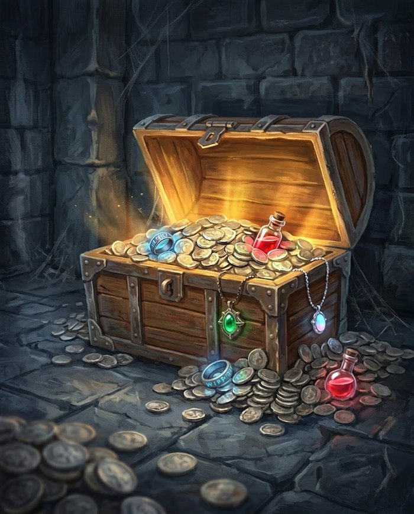

# Recompensas

O que o grupo leva de uma sessão: nível, dinheiro, item e as coisas que não têm ficha.

## Progressão: um nível por sessão

**Ao fim de cada sessão jogada, todo personagem sobe um nível.** Não há experiência pra somar, nem contabilidade de encontros — o grupo jogou, o grupo evoluiu.

O que se ganha em cada nível está na [tabela de progressão](../criacao/progressao.md): **nível par dá +5 pontos de Atributo**, e **nível ímpar dá uma Habilidade nova até o 39 — depois, só a cada 10 níveis**; Vida e Mana crescem em todos.

!!! mestre "O que isso significa de ritmo"
    Uma campanha do nível 1 ao 20 dura **20 sessões** — jogando semanalmente, uns cinco meses. É ritmo de campanha curta e densa: o grupo ganha uma habilidade nova a cada duas sessões e sente progresso toda vez que senta à mesa. Se você quiser uma crônica mais longa, o ajuste é direto: **1 nível a cada 2 sessões** dobra a campanha para 40, e a cada 3 leva a 60. A regra é a mesma, só muda o divisor.

!!! regra "Quem faltou"
    O nível é da sessão, não da presença — se um jogador não pôde vir, ele sobe junto. O contrário cria uma bola de neve onde quem falta uma vez nunca mais alcança o grupo, e isso pune a vida real, não o personagem.

## Dinheiro

Três moedas, na escala de dez:

| Moeda | Vale | Serve pra |
|---|---|---|
| **Cobre** (c) | — | o dia a dia: refeição, cerveja, uma noite em estalagem ruim |
| **Prata** (p) | 10 cobre | equipamento, serviços, viagem — **é a unidade de referência** dos preços |
| **Ouro** (o) | 10 prata | o que muda de vida: cavalo, casa, suborno de gente importante |

Todos os preços do [Equipamento](../equipamento/regras.md#tabela-de-dados-de-dano) estão em **prata**.

### Para dar escala

| Coisa | Preço |
|---|---|
| Refeição, caneca de cerveja | 2 c |
| Noite em estalagem comum | 5 c |
| Dia de trabalho de um artesão | 1 p |
| Arma leve (1d6) | 30 p |
| Arma média (1d8) | 60 p |
| Armadura média | 100 p |
| Arma pesada (1d12) | 240 p |
| Cavalo de sela | 200 p |
| Passagem de navio entre cidades | 20 p |

**Riqueza inicial:** 50 prata, além do equipamento e da arma escolhidos na criação (ver [Criação de Personagem](../criacao/index.md)). Dá pra comprar armadura leve e sobrar troco, ou guardar pra uma arma melhor.

### Tesouro por criatura derrotada

Some o que cada criatura carrega. Um bicho selvagem não carrega dinheiro — só quem usa dinheiro tem dinheiro.

| Tier | Carrega | Observação |
|---|---|---|
| **Comum** | 1d6 cobre | um goblin tem trocados; um lobo não tem nada |
| **Treinado** | 1d10 prata | bandido, soldado, mercenário — gente que recebe pagamento |
| **Formidável** | 2d20 prata | e **1 item** de raridade Comum, se fizer sentido pro conceito |
| **Lendário** | 3d100 prata | e **1 item Raro ou Lendário** — é o tesouro do arco, não da sessão |

!!! exemplo "Na prática"
    Um encontro Padrão (8 pontos) rende de 3 a 40 prata, dependendo de você usar oito goblins ou um Formidável (2d20 prata). Depois de cinco ou seis encontros o grupo consegue bancar armadura média ou trocar de arma — que é o ritmo certo, porque equipamento aqui é conforto, não requisito.

## Itens

A raridade decide **que tipo** de coisa o item faz — não só o quanto.

| Raridade | O que faz | Onde aparece |
|---|---|---|
| **Comum** | bônus numérico pequeno: +1 de dano, +1 de Defesa, +3 de Mana máximo | comprável (150–250 p), ou tesouro de Formidável |
| **Raro** | concede **uma Habilidade** de graça, sem gastar escolha de nível | não se compra; tesouro de Lendário ou recompensa de arco |
| **Lendário** | concede uma Habilidade **Suprema**, ou faz algo que nenhuma regra faz | um por campanha, e a história inteira gira em volta dele |

### Por que Raro concede habilidade

Num sistema onde **tudo é habilidade** e não há classes, dar uma habilidade é a recompensa mais forte que existe — mais que qualquer +1. E há precedente: [raças](../racas/index.md) já concedem habilidade de graça (a Baforada Dracônica do Sangue-de-Dragão, a Mordida Feroz), então a mecânica não é nova, só está sendo reaproveitada.

O efeito colateral é a melhor parte: um item Raro **muda o que o personagem pode fazer**, não os números dele. Uma espada que ensina Corte Duplo transforma o guerreiro que só tinha Ataque Básico; um anel que concede uma magia de Fogo abre um caminho que aquele personagem nunca comprou. É recompensa que gera decisão, não inflação.

### Cuidado com o bônus numérico

O dano dos personagens cresce pouco neste sistema — só **2,7x** do nível 1 ao 20, contra 7,6x da Vida. Isso quer dizer que **+1 de dano pesa mais aqui do que num d20 tradicional**, e três itens de +1 empilhados desregulam mais do que parecem. Duas travas simples:

- **Bônus numérico não acumula com outro do mesmo tipo** — vale o maior. Duas armas de +1 de dano seguem sendo +1.
- **No máximo um item Comum por personagem** em circulação, até o nível 10. Depois disso o grupo já tem habilidades boas o bastante pra que o +1 não seja o eixo da ficha.

### Item não substitui arma

Um item mágico pode **ser** uma arma (a espada que concede um golpe), mas ele não muda o dado nem o [tipo de dano](../jogar/dano-e-cura.md#tipos-de-dano) dela: a espada mágica continua 1d8 Cortante. Isso mantém o Bestiário funcionando — se um item pudesse mudar o tipo de dano, a Vulnerabilidade a Impacto do Esqueleto viraria decoração.

## As recompensas que não têm ficha

Costumam valer mais que o tesouro, e não custam equilíbrio nenhum:

- **Informação** — o mapa da masmorra, o nome verdadeiro do vilão, a fraqueza da criatura. Num sistema com [Vulnerabilidade](../glossario.md#vulnerabilidade), descobrir que o chefe teme Fogo vale mais que +1 de dano.
- **Acesso** — a chave, a senha, o convite pro salão, o favor de quem abre portas.
- **Aliado** — alguém que aparece quando chamado. Mecanicamente, é uma criatura do [Bestiário](../bestiario/index.md) que luta ao lado do grupo por uma cena.
- **Reputação** — o preço que baixa, o guarda que não revista, a taverna que não cobra. Rende mais sessões de jogo que uma bolsa de prata.
- **Descanso garantido** — num sistema onde Mana só volta em [descanso](../jogar/mana.md#recuperacao), oferecer um lugar seguro pra dormir **é** recompensa mecânica.
