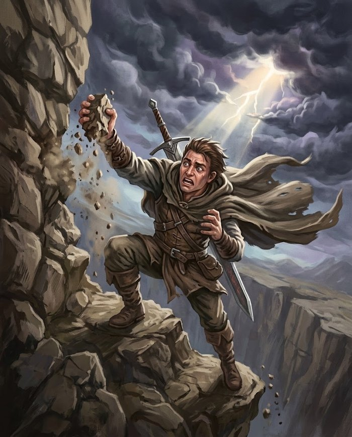

# Testes e Dificuldades

Quanto pedir num teste fora de combate, e quando não pedir nada.

## A tabela

Todo teste é **d100 + Atributo vs Dificuldade**. Igualar já é sucesso.

| Dificuldade | Nome | Como é a tarefa | Exemplo |
|---|---|---|---|
| **25** | Trivial | qualquer pessoa acorda sabendo fazer | ouvir um grito no quarto ao lado, subir num muro baixo |
| **50** | Fácil | exige atenção, não talento | escalar uma parede com apoios, arrombar um cadeado simples, convencer um guarda desinteressado |
| **75** | Média | precisa de treino de verdade | escalar uma muralha lisa, forçar uma porta emperrada, ler um dialeto antigo |
| **100** | Difícil | especialista tentando com esforço | arrombar o cofre de um banco, atravessar um salão cheio sem ser visto, negociar com quem já disse não |
| **125** | Muito difícil | poucos no mundo conseguem | escalar no gelo durante a tempestade, decifrar uma língua morta sem referência |
| **150** | Lendário | histórias são contadas sobre isso | saltar entre torres num vendaval, convencer um dragão a abrir mão do tesouro |

### A Dificuldade mede a tarefa, não o personagem

Um cadeado simples é **Dificuldade 50** no primeiro dia de campanha e continua **Dificuldade 50** no nível 100. Isso é proposital: aos poucos, o especialista para de errar naquilo que domina — e essa é a recompensa de ter investido no atributo, não um defeito da tabela.

Em números: **Dificuldade 50 e 75 viram rotina** pra quem investiu no atributo certo — um personagem com Atributo 100 (o teto) acerta qualquer uma das duas sem nem precisar rolar bem. Já as duas mais altas, **125 e 150, nunca viram rotina**, nem pro personagem mais especializado do jogo: nem um 100 natural sozinho alcança sem Atributo investido. É por isso que elas existem: não pra punir, mas pra você ainda ter o que oferecer a um grupo veterano.

## Quando não pedir teste

Duas regras que economizam mais tempo de mesa que qualquer tabela:

!!! regra "Se não pode dar errado, não role"
    Um ladrão experiente abrindo um cadeado comum, sem ninguém por perto e sem pressa, simplesmente abre. Pedir rolagem transforma competência em sorteio, e um 1 natural gera uma cena idiota — o especialista falhando no que ele é.

!!! regra "Se é impossível, também não role"
    Pedir um teste é dizer "isso pode dar certo". Um jogador que rola acredita que existe caminho, e negar depois do dado é quebrar a promessa. Se a resposta é não, diga não antes — e ofereça o que *seria* possível.

## Críticos, e a rolagem de 1

Não existe mais "20 natural" nem falha crítica ("fumble") neste sistema — o crítico escala com Sorte, através do **limiar de Crítico** (ver [Críticos](../jogar/testes.md#criticos)): rolar igual ou abaixo do limiar é sucesso automático e crítico, não importa a Dificuldade.

**Tirar exatamente 1** no d100 sempre marca **1 ponto de [Estresse](../glossario.md#estresse)**, mesmo quando o resultado é sucesso ou crítico — o preço mental de escapar por pouco.

O princípio de sempre: **se a tarefa fosse impossível, o teste não deveria ter sido permitido.** Autorizar a rolagem já é admitir que há chance. O Mestre decide se rola; o dado decide o resto.

## Calibração de dano

Duas tabelas de referência, pra escolher rápido quanto dano ou Estresse um golpe improvisado causa:

**Dano médio por XdY** — quantos dados de cada tamanho, e o que isso dá em média:

| Dados | d4 | d6 | d8 | d10 | d12 | d20 |
|---|---|---|---|---|---|---|
| 1 | 2,5 | 3,5 | 4,5 | 5,5 | 6,5 | 10,5 |
| 2 | 5 | 7 | 9 | 11 | 13 | 21 |
| 4 | 10 | 14 | 18 | 22 | 26 | 42 |
| 8 | 20 | 28 | 36 | 44 | 52 | 84 |

**Calibrado contra Vida do personagem** — mirando em ~10 golpes pra derrotar um alvo equivalente, constante em todo nível:

| Nível | Vida (Guerreiro típico) | Dano médio alvo (Vida ÷ 10) | XdY mais próxima |
|---|---|---|---|
| 0 | 40 | 4 | 1d6 |
| 25 | 79 | 8 | 2d8 |
| 50 | 134 | 13 | 2d12 |
| 75 | 205 | 21 | 2d20 |
| 100 | 290 | 29 | 3d20 |

A regra de escalada por Intensidade (I = dado da arma, II = sobe um degrau, III = 2× o dado da II — ver [Dado de Dano](../jogar/dano-e-cura.md#dado-de-dano)) já bate com essa curva sozinha: arma **d10** na Intensidade III entrega 2d12 (bate com o nível 50); arma **d12** entrega 2d20 (bate com o nível 75).

Ver também a [Tabela de Dano Improvisado](../jogar/estresse.md#tabelas-de-referencia-rapida), com exemplos prontos pra usar sem calcular nada.

## Testes em grupo

Quando várias pessoas encaram a mesma coisa, há três formas de resolver — e a escolha certa vem de uma pergunta só:

> **Quem está fazendo a ação?**

### Cada um por si — agindo em paralelo

Todos fazem a mesma coisa, mas **separadamente**, e o resultado de um não muda o do outro. Cada personagem rola e vive o próprio resultado.

Use quando a falha individual render cena: atravessar um rio a nado, escalar uma encosta, saltar um vão. Quem falha escorrega, se molha, se machuca — e isso é conteúdo, não punição.

### Metade precisa passar — agindo como um só

O grupo age como **uma unidade** e não faz sentido alguém falhar sozinho: ou o portão abre, ou não abre. Todos rolam, e o grupo passa se metade ou mais tiver sucesso; quem falhou foi carregado pelos outros.

Use quando o esforço é somado: empurrar algo pesado, remar contra a corrente, marchar dias na neve, sustentar um ritual. Também é a saída quando um personagem fraco travaria a história inteira numa tarefa de rotina.

### O melhor lidera — um faz, os outros acompanham

**Uma pessoa executa** e o resto se beneficia. Só ela rola.

Use quando a perícia de um serve pra todos: rastrear uma trilha, identificar um símbolo, guiar pela floresta, pechinchar um preço. Se alguém do grupo estiver ativamente atrapalhando (o desastrado falando na negociação), role com **Desvantagem** em vez de pedir teste separado.

### Furtividade é caso especial

Esconder-se em grupo não segue nenhum dos três limpo: **o grupo é tão furtivo quanto o pior integrante**, porque basta uma armadura rangendo pra denunciar todo mundo. Peça que cada um role, mas aplique a **consequência coletiva** — se um falhou, o inimigo suspeita. E deixe isso claro *antes* de rolar: é o que faz o grupo decidir se o desastrado espera do lado de fora.

## Testes Sociais têm alvo, não Dificuldade fixa

[Persuadir, Intimidar e Amedrontar](../jogar/testes.md#testes-sociais) contra uma criatura **não** usam a tabela de Dificuldades: usam o **Social** dela, cru — o valor que está na ficha, sem nenhum bônus de Tier somado por baixo. É o mesmo princípio de qualquer efeito que pula a Evasão neste jogo: quem resiste é o Social do alvo, não uma dificuldade abstrata (ver [Defesa](../glossario.md#defesa)).

| Alvo | Social típico | Um personagem com Social 25 convence |
|---|---|---|
| Camponês, capanga (Comum) | 10 | ~100% das vezes |
| Soldado, mercador (Treinado) | 35 | 91% |
| Capitão, monstro (Formidável) | 55 | 71% |
| Dragão, lich (Lendário) | 90 | 36% |

Use a tabela de Dificuldades só quando **não há criatura do outro lado** — convencer uma multidão sem líder definido, manter a compostura numa corte hostil, decifrar a intenção de uma carta.

!!! cuidado "O que o teste social não faz"
    Ele muda a **disposição** do alvo, não a vontade dele. Um guarda persuadido pode fazer vista grossa, aceitar suborno ou olhar pro outro lado — não vai trair quem ama nem abrir a cela do assassino do próprio irmão. Se o pedido contraria algo central pro personagem, a resposta é não antes do dado (a mesma regra de "se é impossível, não role").

## Vantagem, Desvantagem e rerrolagem

A regra está em [Vantagem e Desvantagem](../jogar/testes.md#vantagem-e-desvantagem). O que interessa aqui é **quando** você concede uma ou outra:

- **Vantagem** — pra premiar preparação, ferramenta certa ou boa ideia. É mais elegante que dar bônus numérico: não infla nada e o jogador sente na hora.
- **Desvantagem** — pra condição ruim, pressa, ferimento, improviso. É como o mundo cobra sem precisar de uma penalidade nova.
- **[Rerrolagem](../jogar/testes.md#rerolagens)** — o jogador tem **1 + (Sorte ÷ 10)** por descanso longo e só pode usar num teste que **falhou**. Se um teste é dramático o bastante, vale avisar que é a última chance: assim ele decide se queima o recurso.

Como as duas não acumulam, não adianta empilhar motivos — **uma Vantagem já é toda a Vantagem que existe**. Se você quer premiar mais que isso, o caminho é baixar a Dificuldade ou dispensar a rolagem.
