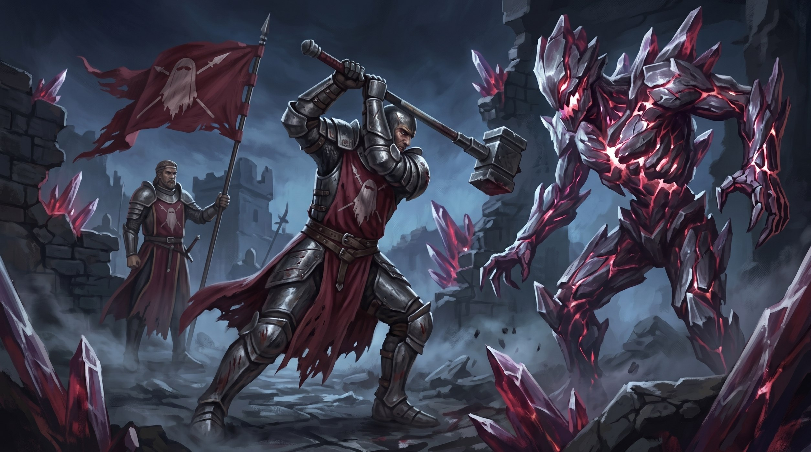

# Guarda do Véu

- **Retrato:** 
- **Tipo:** Ordem religiosa militante, independente
- **Patrono:** [Val](../panteao/val.md)
- **Território:** sem território próprio — mantém um posto avançado perto da [fronteira entre Tyria e Guang](../eventos/fronteiras-de-tyria-guang.md)
- **Lado no conflito:** nenhum. Não serve à [Aliança dos Três Povos](alianca-dos-tres-povos.md) nem aos [Orcs](orcs.md) — caça o que os dois lados da guerra preferem não admitir que está crescendo nas sombras

A Guarda do Véu não é um exército. Enquanto a Aliança e os Orcs lutam por território e pelo [Sídrio](../recursos/sidrio.md), a Guarda existe pra combater algo que nenhum dos dois lados tem estrutura pra enfrentar: o que rasga **o Véu** — a fronteira entre o mundo e a corrupção. Mortos-vivos, aberrações, cultos profanos, e cada vez mais o que a mineração descontrolada de Sídrio desperta. O mal não escolhe lado de guerra, e a Guarda vasculha os dois territórios sem pedir licença a nenhum.

Nascida do clero de Val, mas sem se subordinar a ele — a Guarda segue os dois dogmas do deus (a Marcha sem Recuo e o Código de Honra do Cruzado) e acrescenta um terceiro,  próprio:

## O Código

1. **Marcha sem Recuo** — jamais abandonar um aliado caído ou recuar de um combate contra o mal verdadeiro, sem ordem clara ou necessidade de salvar inocentes.
2. **Código de Honra do Cruzado** — nada de veneno ou diplomacia desonesta. A vitória se conquista com o aço à vista.
3. **Selar, Não Profanar** — nenhuma corrupção capturada é colhida, vendida ou usada como arma, custe o que custar. Quem quebra essa regra deixa de ser Guarda — e vira alvo.

## Hierarquia

Os nomes das patentes vêm das bênçãos que a tradição atribui a Val — cada posto marca o quanto o crente já provou incorporar aquele ideal aos olhos da Ordem, não um poder concedido automaticamente pela patente:

| Patente | Papel |
|---|---|
| **Postulante** | recruta, ainda não jurou o Código |
| **Guardião** | membro pleno, caçador de campo |
| **Portador do Estandarte** | veterano — carrega o estandarte da Ordem em combate, e dizem que só a presença dele já sustenta o ânimo de quem luta ao lado |
| **Punho do Justo** | comandante de posto — o título evoca a lendária Carga do Justo, reservado a quem já provou golpear a escuridão como se fosse um só golpe |
| **Coração de Leão** | líder da Ordem — reza-se que encarna o ideal por completo: nada o abala, e dizem que essa presença por si só ampara quem estiver perto o bastante pra senti-la |

## Símbolo

Um véu rasgado, cruzado por uma lança — tabardo distinto do clero comum de Val, que usa a cruz de calatrava. A Guarda se vê como algo à parte até da própria fé que a originou.

## Como o mundo vê a Guarda

Com uma mistura de alívio e desconfiança. Para os inocentes que salvam, são heróis. Para os generais dos dois lados da guerra, são uma incógnita: será que atrapalham o esforço de guerra? Consomem recursos que podiam ir pra frente de batalha? A Guarda nunca respondeu a essa pergunta — e não parece se importar em responder.
