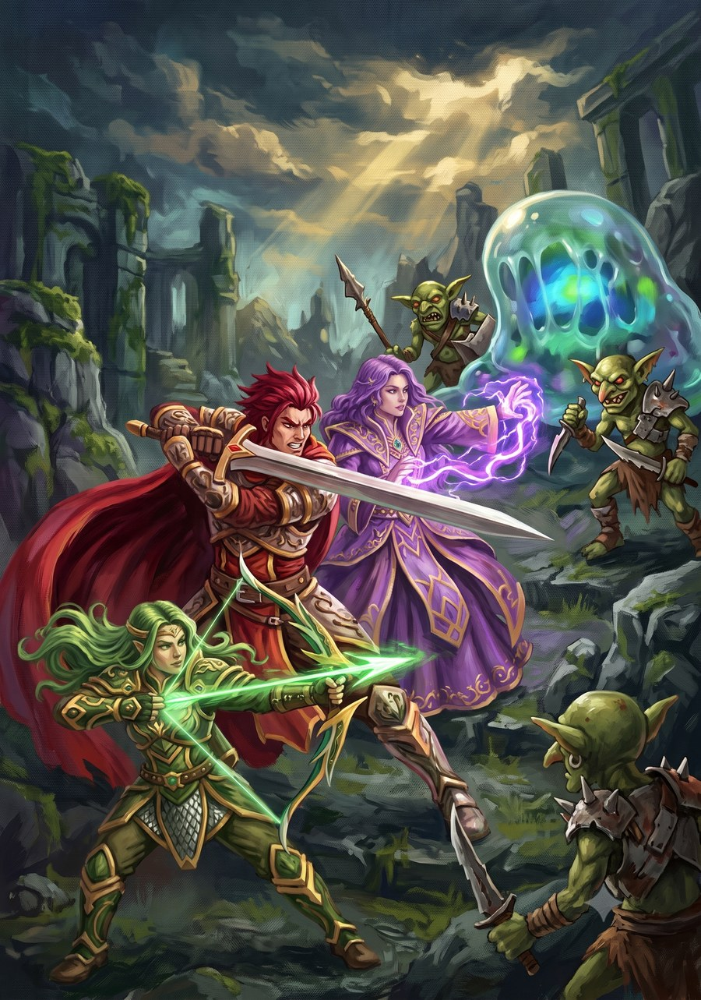

# Mundo

O cenário da campanha, registrado conforme o grupo for jogando — não é uma bíblia
escrita antes da mesa, é o mapa e a lore crescendo junto com o que acontece nas sessões.

- [**Mapa de Pania**](mapa.md) — mapa interativo do mundo e da capital, Torirue, com
  pontos de interesse clicáveis e a descrição de cada lugar.

## Lugares

- [Poponia](lugares/poponia.md) — o reino Humano
- [Torirue](lugares/torirue.md) — a capital, símbolo da Aliança dos Três Povos
- [Tyria](lugares/tyria.md) — reino Humano na linha de frente
- [Guang](lugares/guang.md) — reino Orc, fronteira com Tyria
- [Jingyuan Guo](lugares/jingyuan-guo.md) — reino Orc
- [Yan Guo](lugares/yan-guo.md) — reino Orc, ao norte
- [Testa de Ferro](lugares/testa-de-ferro.md) — terra distante ao norte, lar dos clãs Branari e do culto a Bran
- [Kaelen Hold](lugares/kaelen-hold.md) — a Fortaleza de Ferro, maior cidade da Testa de Ferro
- [A Garganta do Cervo](lugares/garganta-do-cervo.md) — o maior templo aberto de Bran
- [A Trilha dos Caçadores Fantasmas](lugares/trilha-dos-cacadores-fantasmas.md) — onde a Caça Selvagem de Bran se manifesta
- [O Túmulo dos Guardiões](lugares/tumulo-dos-guardioes.md) — tumba subterrânea sob o gelo

## Facções

- [Aliança dos Três Povos](faccoes/alianca-dos-tres-povos.md) — Humanos, Anões e Elfos
- [Orcs](faccoes/orcs.md) — o outro lado da guerra
- [Guarda do Véu](faccoes/guarda-do-veu.md) — ordem independente devota a Val, caça o que a guerra não vê
- [Coven das Irmãs](faccoes/coven-das-irmas.md) — três bruxas imortais, itinerantes, recrutam (ou sacrificam) moças de aldeia em aldeia
- [Devoradores de Ossos](faccoes/devoradores-de-ossos.md) — culto que perverteu o dogma do sacrifício de Bran
- [Gigantes da Geada](faccoes/gigantes-da-geada.md) — invasores do norte, cavalgam Wargs da Neve

## Personagens

- [PF](personagens/pf.md) — jogado por Café, isekai reencarnado em Pania, acompanhado da MCP

## Pessoas

- [Ester](pessoas/ester.md) — a mais velha do Coven, decide quem vira sacrifício
- [Esme](pessoas/esme.md) — a que convida, sedutora
- [Elsa](pessoas/elsa.md) — cuida das que ficam
- [Ondrus](pessoas/ondrus.md) — NPC sábio itinerante, mestre do Arcano, não serve a nenhum lado da guerra
- [Rujerd](pessoas/rujerd.md) — chefe de Kaelen Hold, velho e enfraquecendo, filhos disputam o trono

## Itens

- [O Grito de Sondu](itens/o-grito-de-sondu.md) — espada lendária forjada em Yan Guo, sela a alma de quem mata

## Eventos

- [Fronteiras de Tyria Guang](eventos/fronteiras-de-tyria-guang.md) — zona de guerra ativa

## Recursos

- [Sídrio](recursos/sidrio.md) — o cristal mágico disputado por trás da guerra

## Panteão

- [Jovar](panteao/jovar.md) — deus da conquista e da estratégia
- [Kai](panteao/kai.md) — deus da tempestade e da mudança
- [Bran](panteao/bran.md) — deus do sacrifício e guardião do inverno
- [Val](panteao/val.md) — deus da cruzada e do fervor inabalável

*(Seção nova — cresce conforme a campanha acontece.)*
