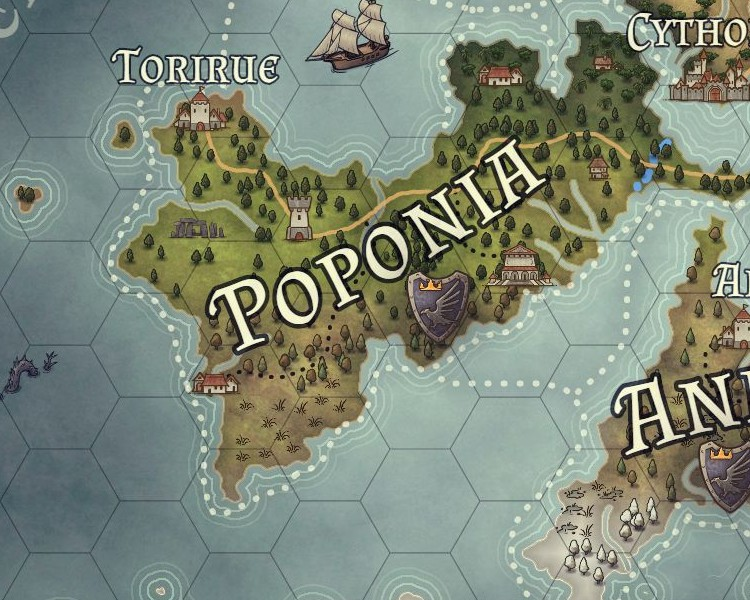

# Poponia

- **Mapa:** 
- **Tipo:** Reino
- **Governo:** Monarquia
- **Facção controladora:** [Aliança dos Três Povos](../faccoes/alianca-dos-tres-povos.md)

Poponia é o reino Humano de Pania. Sua capital é [Torirue](torirue.md).
