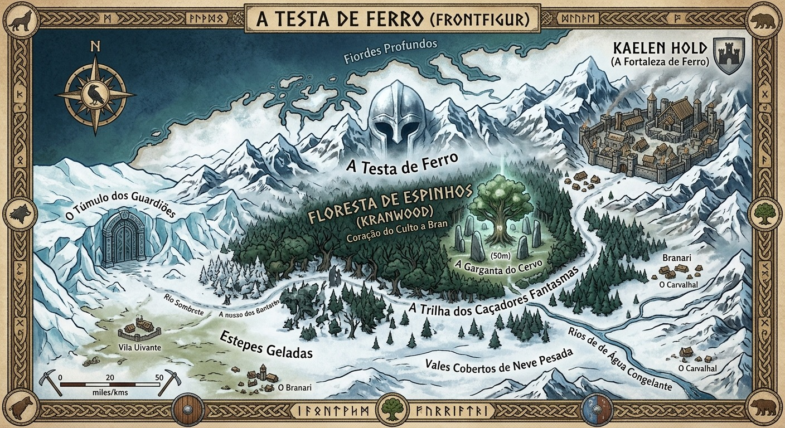

# Testa de Ferro

- **Mapa:** 
- **Tipo:** Região distante ao norte de [Yan Guo](yan-guo.md), sem envolvimento na guerra entre a [Aliança dos Três Povos](../faccoes/alianca-dos-tres-povos.md) e os [Orcs](../faccoes/orcs.md)
- **Governo:** Clãs (os Branari)
- **Divindade principal:** [Bran](../panteao/bran.md)

Uma terra de fiordes profundos, vales cobertos de neve pesada, estepes geladas e florestas
densas onde a luz do sol mal toca o solo. A neve cai oito meses por ano; nos quatro
restantes, o degelo revela musgo, carvalhos enormes e rios de água congelante.

No coração da região fica a **Floresta de Espinhos** (*Kranwood*), de difícil acesso, com
raízes ancestrais de carvalhos e pinheiros brancos — o coração do culto a
[Bran](../panteao/bran.md). Dizem que as árvores sangram seiva vermelha quando um sacrifício
honorável é feito em suas raízes.

## Sociedade e cultura

A sociedade é organizada em clãs — os **Branari**. A honra de um homem ou mulher se mede
pelo quanto abre mão das próprias necessidades pra garantir a sobrevivência do clã durante
as grandes intempéries. Antes de cada inverno, cada vila realiza o **Rito do Carvalho**:
caçadores e guerreiros oferecem parte da colheita, da caça e até do próprio sangue — em
pequenos cortes rituais — em altares de pedra com a Runa da Proteção, pedindo a bênção de
Bran pra fechar os portões contra os monstros do gelo.

Os **Druidas de Espinho** (*Bran-Drui*) são os líderes espirituais da região: vestem peles
de lobo e cervo, usam máscaras entalhadas em madeira sagrada, e atuam como juízes,
curandeiros e guias táticos.

## Locais

- [Kaelen Hold](kaelen-hold.md) — a Fortaleza de Ferro, maior cidade da região
- [A Garganta do Cervo](garganta-do-cervo.md) — o maior templo aberto de Bran
- [A Trilha dos Caçadores Fantasmas](trilha-dos-cacadores-fantasmas.md) — onde a Caça Selvagem de Bran se manifesta
- [O Túmulo dos Guardiões](tumulo-dos-guardioes.md) — tumba subterrânea sob o gelo

## Ameaças conhecidas

- [Devoradores de Ossos](../faccoes/devoradores-de-ossos.md) — culto que perverteu o dogma do sacrifício de Bran
- [Gigantes da Geada](../faccoes/gigantes-da-geada.md) — descem das montanhas com matilhas de [Warg da Neve](../../bestiario/index.md#bes-warg-da-neve) pra saquear os clãs
- **A Fome Entrincheirada** — guerreiros que quebraram o código de honra de Bran (canibalismo ou covardia num inverno passado) e voltam como [mortos-vivos amaldiçoados](../../bestiario/index.md#bes-fome-entrincheirada), vagando pela floresta

## Ganchos em aberto

!!! mestre "Ideias do Mateus pra sessões na Testa de Ferro — use o que servir à sua mesa, nada abaixo é fato confirmado em jogo"
    - **A Noite Sem Fim:** a vila de Skol não vê o sol nascer há três dias. A neve bloqueou
      os caminhos e uivos inumanos cercam a paliçada. Os aventureiros precisam defender a
      vila contra levas de mortos-vivos congelados ou monstros da neve enquanto ajudam o
      druida ancião local a realizar o Rito do Sangue de Bran pra restaurar a barreira
      rúnica do vilarejo.
    - **O Sacrifício do Rujerd:** o filho mais novo de [Rujerd](../pessoas/rujerd.md) foi
      capturado por um bando de [Gigantes da Geada](../faccoes/gigantes-da-geada.md). A lei
      de Bran exige que o líder não envie o exército inteiro se isso arriscar o clã — mas um
      grupo de forasteiros voluntários pode assumir a missão de resgate.
    - **O Chamado da Caça Selvagem:** algo corrompeu a raiz do Carvalho Sagrado na
      [Garganta do Cervo](garganta-do-cervo.md). A profecia diz que só o sangue de um dragão
      branco antigo, sacrificado em nome de Bran com uma arma rúnica abençoada, pode
      purificar a terra antes que o vale inteiro seja engolido pela morte eterna.
    - **O Sangue das Árvores:** no coração da Floresta de Espinhos, os druidas notaram que a
      seiva sagrada dos carvalhos ancestrais parou de correr vermelha. Em vez disso, a
      madeira está minando uma substância negra e gélida que mata tudo ao redor. Os
      aventureiros precisam investigar a fonte da contaminação.
    - **A Criança Descalça na Neve:** caravanas relatam ver uma garotinha caminhando descalça
      pelas tempestades sem sofrer com o frio. Ela não fala, só aponta pras montanhas e
      desaparece na nevasca. Ela é a projeção de um espírito que guardava algo importante:
      um nobre ganancioso quebrou secretamente um pacto de proteção local, e a tempestade só
      cessará quando o pacto for restaurado ou a dívida de sangue for paga.
    - **O Julgamento das Três Runas:** dois clãs rivais estão à beira da guerra depois da
      morte de um Chefe. O clã rival é acusado de assassinato covarde por envenenamento —
      pecado gravíssimo contra o dogma de Bran. Pra evitar derramamento de sangue
      desnecessário antes do inverno, os Anciões contratam os forasteiros como
      investigadores imparciais, ou eles enfrentam o perigoso Julgamento de Bran — uma
      provação em que a terra decide quem diz a verdade.
    - **A Herdeira e o Leão de Aço:** um contingente de templários de [Val](../panteao/val.md)
      chega às terras do norte pregando a "Ordem e a Fé Verdadeira", tratando as tradições de
      Bran como barbárie paganista. A herdeira de um clã local quer se converter pra selar
      uma aliança militar com os cruzados, enquanto os druidas exigem que ela mantenha a
      tradição e o sacrifício de seu povo. Os aventureiros decidem se favorecem a
      diplomacia, escolhem um lado, ou tentam evitar que a guerra devaste o vale.
    - **O Expresso do Gelo:** uma caravana leva comida, remédios e madeira sagrada e precisa
      cruzar a [Trilha dos Caçadores Fantasmas](trilha-dos-cacadores-fantasmas.md) antes que
      a primeira grande nevasca do ano feche as montanhas. Os aventureiros são contratados
      como guarda-costas — além do frio extremo e da gestão de recursos, precisam defender a
      caravana de matilhas de [Warg da Neve](../../bestiario/index.md#bes-warg-da-neve)
      famintos e armadilhas deixadas por saqueadores. Há possibilidade de seres indesejados
      aparecerem.
    - **O Templo Flutuante do Lago Congelado:** a cada cinquenta anos, as águas do Lago das
      Brumas congelam completamente, revelando a entrada de um antigo templo submerso de
      Bran, visível só por 7 dias. Os aventureiros têm essa janela pra explorar o templo,
      enfrentar construtos de gelo ancestral, e recuperar o lendário Estandarte do Guardião
      antes que o lago degele e sele o local por meio século.
    - **A Fúria do Urso-Ancião:** um gigantesco urso-coruja abençoado por Bran séculos atrás
      enlouqueceu de dor depois que caçadores estrangeiros roubaram suas crias pra vender no
      sul. A besta está destruindo vilarejos inteiros. Matá-la trará a ira das criaturas da
      neve — a opção melhor (e mais difícil) é rastrear os traficantes, resgatar os filhotes,
      e acalmar a criatura antes que seja tarde.
    - **O Eco do Berrante de Bran:** o Berrante da Caça Selvagem foi roubado por um
      Comandante [Gigante da Geada](../faccoes/gigantes-da-geada.md). Ele pretende tocá-lo na
      noite do Solstício de Inverno pra invocar os monstros da Caça Selvagem como exército
      pessoal e conquistar toda a Testa de Ferro. Uma corrida contra o tempo espera os
      aventureiros, que precisam recuperar o artefato e realizar o ritual de selamento com os
      anciãos no topo da montanha mais alta da região.

Ideias de mundo de Mateus, um amigo de mesa, organizadas e integradas ao site.
