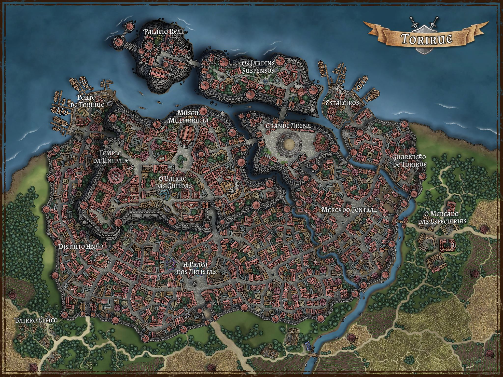

# Torirue

- **Mapa:** 
- **Tipo:** Capital
- **Governo:** Monarquia
- **Pertence a:** [Poponia](poponia.md)
- **Facção controladora:** [Aliança dos Três Povos](../faccoes/alianca-dos-tres-povos.md)

Capital do Reino Humano de Poponia. Símbolo vivo da Aliança dos Três Povos — humanos,
anões e elfos vivem, comerciam e lutam lado a lado ali, com o Distrito Anão e o
Bairro Élfico funcionando de verdade dentro da capital humana.

Veja também o [mapa interativo de Torirue](../mapa.md), com os pontos de interesse
da cidade.
