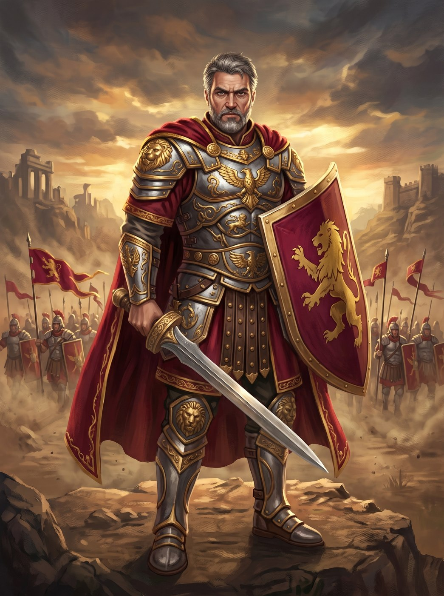

# Jovar

- **Retrato:** 
- **Domínio:** Conquista, estratégia e ordem militar
- **Tendência:** Leal ou Neutro
- **Símbolo Sagrado:** uma espada curta de aço cruzada sobre um escudo

Jovar é o patrono dos estrategistas, dos imperadores e da ordem militar — o deus do aço
refinado e da disciplina que vence guerras antes delas começarem. Ele não representa a
fúria cega da batalha, mas a marcha calculada, a linha que não se rompe, e o direito de
governar pela força e pela lei.

Reza-se que os generais que buscam a bênção de Jovar lutam com a mira mais precisa de
seus exércitos, que suas tropas não conhecem o medo enquanto a ordem se mantiver, e que
nenhuma muralha de escudos erguida em seu nome já foi rompida. O clero de Jovar não
perdoa quem quebra uma promessa de batalha ou recua sem uma razão tática clara — para
eles, honra e disciplina são a mesma coisa.
