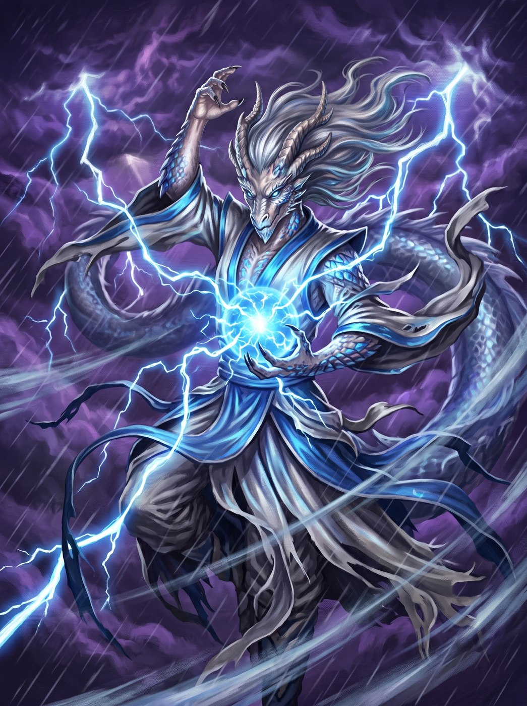

# Kai

- **Retrato:** 
- **Domínio:** Tempestade, transformação e as forças elementais
- **Tendência:** Caótico Neutro ou Neutro
- **Símbolo Sagrado:** uma garra de dragão segurando uma esfera azul

Kai é a personificação da força indomável dos céus — o trovão, a chuva que fertiliza os
campos e o tufão que arrasa impérios na mesma respiração. É venerado por quem busca
quebrar correntes, superar limites ou dominar as forças elementais, e por quem entende
que toda tempestade também é o começo de alguma coisa.

Contam as lendas que os devotos de Kai golpeiam com a fúria dos céus atrás de cada
acerto, que atravessam o campo de batalha no passo do vento, e que o sopro da tempestade
os acompanha para onde forem. O único pecado que seu culto não perdoa é a estagnação: um
devoto de Kai deve sempre buscar crescer ou provocar mudança ao seu redor — parar é
morrer, aos olhos dele.
