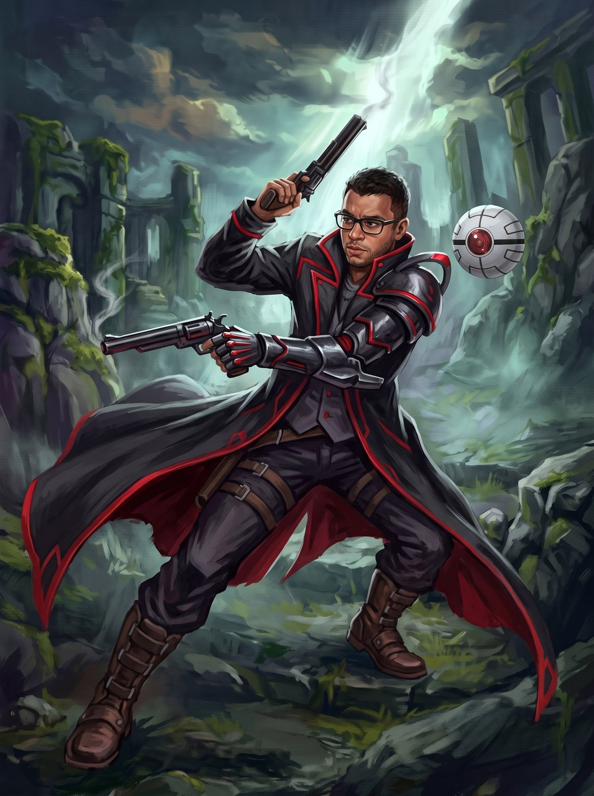

# PF

- **Retrato:** 
- **Jogador:** Café
- **Raça:** [Isekai](../../racas/index.md#rac-isekai)
- **Pacote:** [MCP](../../pacotes/index.md#pac-mcp)
- **Status:** Vivo

Não pediu pra vir. Estava a caminho do estádio quando um caminhão desgovernado tirou sua vida
antes mesmo de terminar a rota — e o próximo instante que lembra é acordando em Pania, num corpo
que reconhece mas não é bem o seu, com a certeza estranha de que aquilo não foi acidente nenhum.
Sorte de protagonista, dizem por aí.

Chegou sozinho, mas não ficou: uma esfera pequena e sem nome apareceu junto, mal sabendo
distinguir luz de sombra. Ele batizou de MCP — Meu Companheiro Pensante — antes mesmo dela ter
palavras pra escolher o próprio nome. Ela aprendeu rápido; ele ainda está aprendendo a viver de
novo.

Anda com um longo casaco escuro debruado de vermelho e duas pistolas de cano longo à cintura —
mais hábito de outra vida do que necessidade real, já que a MCP costuma resolver o que as balas
não dariam conta.
